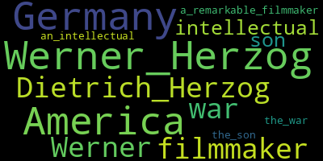
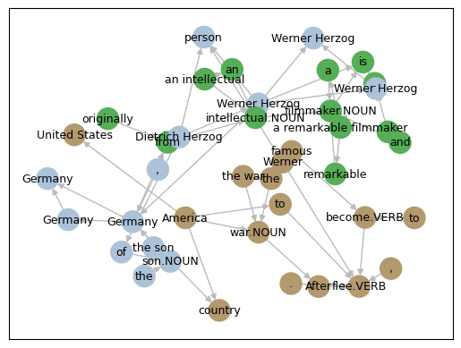
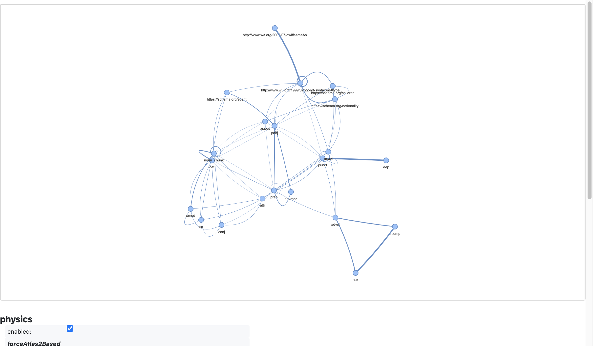

!!! note
    To run this notebook in JupyterLab, load [`examples/ex0_0.ipynb`](https://github.com/DerwenAI/textgraphs/blob/main/examples/ex0_0.ipynb)


# demo: TextGraphs + LLMs to construct a 'lemma graph'

_TextGraphs_ library is intended for iterating through a sequence of paragraphs.

## environment


```python
from IPython.display import display, HTML, Image, SVG
import pathlib
import typing

from icecream import ic
from pyinstrument import Profiler
import matplotlib.pyplot as plt
import pandas as pd
import pyvis
import spacy

import textgraphs
```


```python
%load_ext watermark
```


```python
%watermark
```

    Last updated: 2024-01-03T13:12:25.022356-08:00

    Python implementation: CPython
    Python version       : 3.10.11
    IPython version      : 8.18.1

    Compiler    : Clang 13.0.0 (clang-1300.0.29.30)
    OS          : Darwin
    Release     : 21.6.0
    Machine     : x86_64
    Processor   : i386
    CPU cores   : 8
    Architecture: 64bit


```python
%watermark --iversions
```

    sys       : 3.10.11 (v3.10.11:7d4cc5aa85, Apr  4 2023, 19:05:19) [Clang 13.0.0 (clang-1300.0.29.30)]
    matplotlib: 3.8.2
    textgraphs: 0.2.4
    spacy     : 3.7.2
    pandas    : 2.1.4
    pyvis     : 0.3.2


## parse a document

provide the source text


```python
SRC_TEXT: str = """
Werner Herzog is a remarkable filmmaker and an intellectual originally from Germany, the son of Dietrich Herzog.
After the war, Werner fled to America to become famous.
"""
```

set up the statistical stack profiling


```python
profiler: Profiler = Profiler()
profiler.start()
```

set up the `TextGraphs` pipeline


```python
tg: textgraphs.TextGraphs = textgraphs.TextGraphs(
    factory = textgraphs.PipelineFactory(
        spacy_model = textgraphs.SPACY_MODEL,
        ner = None,
        kg = textgraphs.KGWikiMedia(
            spotlight_api = textgraphs.DBPEDIA_SPOTLIGHT_API,
            dbpedia_search_api = textgraphs.DBPEDIA_SEARCH_API,
            dbpedia_sparql_api = textgraphs.DBPEDIA_SPARQL_API,
    		wikidata_api = textgraphs.WIKIDATA_API,
            min_alias = textgraphs.DBPEDIA_MIN_ALIAS,
            min_similarity = textgraphs.DBPEDIA_MIN_SIM,
        ),
        infer_rels = [
    		textgraphs.InferRel_OpenNRE(
                model = textgraphs.OPENNRE_MODEL,
                max_skip = textgraphs.MAX_SKIP,
                min_prob = textgraphs.OPENNRE_MIN_PROB,
    		),
            textgraphs.InferRel_Rebel(
                lang = "en_XX",
                mrebel_model = textgraphs.MREBEL_MODEL,
            ),
        ],
    ),
)

pipe: textgraphs.Pipeline = tg.create_pipeline(
    SRC_TEXT.strip(),
)
```

## visualize the parse results


```python
spacy.displacy.render(
    pipe.ner_doc,
    style = "ent",
    jupyter = True,
)
```


<span class="tex2jax_ignore"><div class="entities" style="line-height: 2.5; direction: ltr">
<mark class="entity" style="background: #aa9cfc; padding: 0.45em 0.6em; margin: 0 0.25em; line-height: 1; border-radius: 0.35em;">
    Werner Herzog
    <span style="font-size: 0.8em; font-weight: bold; line-height: 1; border-radius: 0.35em; vertical-align: middle; margin-left: 0.5rem">PERSON</span>
</mark>
 is a remarkable filmmaker and an intellectual originally from
<mark class="entity" style="background: #feca74; padding: 0.45em 0.6em; margin: 0 0.25em; line-height: 1; border-radius: 0.35em;">
    Germany
    <span style="font-size: 0.8em; font-weight: bold; line-height: 1; border-radius: 0.35em; vertical-align: middle; margin-left: 0.5rem">GPE</span>
</mark>
, the son of
<mark class="entity" style="background: #aa9cfc; padding: 0.45em 0.6em; margin: 0 0.25em; line-height: 1; border-radius: 0.35em;">
    Dietrich Herzog
    <span style="font-size: 0.8em; font-weight: bold; line-height: 1; border-radius: 0.35em; vertical-align: middle; margin-left: 0.5rem">PERSON</span>
</mark>
.<br>After the war,
<mark class="entity" style="background: #aa9cfc; padding: 0.45em 0.6em; margin: 0 0.25em; line-height: 1; border-radius: 0.35em;">
    Werner
    <span style="font-size: 0.8em; font-weight: bold; line-height: 1; border-radius: 0.35em; vertical-align: middle; margin-left: 0.5rem">PERSON</span>
</mark>
 fled to
<mark class="entity" style="background: #feca74; padding: 0.45em 0.6em; margin: 0 0.25em; line-height: 1; border-radius: 0.35em;">
    America
    <span style="font-size: 0.8em; font-weight: bold; line-height: 1; border-radius: 0.35em; vertical-align: middle; margin-left: 0.5rem">GPE</span>
</mark>
 to become famous.</div></span>


```python
parse_svg: str = spacy.displacy.render(
    pipe.ner_doc,
    style = "dep",
    jupyter = False,
)

display(SVG(parse_svg))
```


## collect graph elements from the parse


```python
tg.collect_graph_elements(
    pipe,
    debug = False,
)
```


```python
ic(len(tg.nodes.values()));
ic(len(tg.edges.values()));
```

    ic| len(tg.nodes.values()): 34
    ic| len(tg.edges.values()): 37


## perform entity linking


```python
tg.perform_entity_linking(
    pipe,
    debug = False,
)
```

## infer relations


```python
inferred_edges: list = await tg.infer_relations_async(
    pipe,
    debug = False,
)

inferred_edges
```


    [Edge(src_node=0, dst_node=10, kind=<RelEnum.INF: 2>, rel='https://schema.org/nationality', prob=1.0, count=1),
     Edge(src_node=15, dst_node=0, kind=<RelEnum.INF: 2>, rel='https://schema.org/children', prob=1.0, count=1),
     Edge(src_node=25, dst_node=20, kind=<RelEnum.INF: 2>, rel='https://schema.org/event', prob=1.0, count=1)]


## construct a lemma graph


```python
tg.construct_lemma_graph(
    debug = False,
)
```

## extract ranked entities


```python
tg.calc_phrase_ranks(
    pr_alpha = textgraphs.PAGERANK_ALPHA,
    debug = False,
)
```

show the resulting entities extracted from the document


```python
df: pd.DataFrame = tg.get_phrases_as_df()
df
```


<div>
<style scoped>
    .dataframe tbody tr th:only-of-type {
        vertical-align: middle;
    }

    .dataframe tbody tr th {
        vertical-align: top;
    }

    .dataframe thead th {
        text-align: right;
    }
</style>
<table border="1" class="dataframe">
  <thead>
    <tr style="text-align: right;">
      <th></th>
      <th>node_id</th>
      <th>text</th>
      <th>pos</th>
      <th>label</th>
      <th>count</th>
      <th>weight</th>
    </tr>
  </thead>
  <tbody>
    <tr>
      <th>0</th>
      <td>0</td>
      <td>Werner Herzog</td>
      <td>PROPN</td>
      <td>dbr:Werner_Herzog</td>
      <td>1</td>
      <td>0.083346</td>
    </tr>
    <tr>
      <th>1</th>
      <td>10</td>
      <td>Germany</td>
      <td>PROPN</td>
      <td>dbr:Germany</td>
      <td>1</td>
      <td>0.083232</td>
    </tr>
    <tr>
      <th>2</th>
      <td>25</td>
      <td>America</td>
      <td>PROPN</td>
      <td>dbr:United_States</td>
      <td>1</td>
      <td>0.080449</td>
    </tr>
    <tr>
      <th>3</th>
      <td>15</td>
      <td>Dietrich Herzog</td>
      <td>PROPN</td>
      <td>dbo:Person</td>
      <td>1</td>
      <td>0.078961</td>
    </tr>
    <tr>
      <th>4</th>
      <td>20</td>
      <td>war</td>
      <td>NOUN</td>
      <td>None</td>
      <td>1</td>
      <td>0.077566</td>
    </tr>
    <tr>
      <th>5</th>
      <td>22</td>
      <td>Werner</td>
      <td>PROPN</td>
      <td>dbo:Person</td>
      <td>1</td>
      <td>0.077566</td>
    </tr>
    <tr>
      <th>6</th>
      <td>4</td>
      <td>filmmaker</td>
      <td>NOUN</td>
      <td>None</td>
      <td>1</td>
      <td>0.076196</td>
    </tr>
    <tr>
      <th>7</th>
      <td>7</td>
      <td>intellectual</td>
      <td>NOUN</td>
      <td>None</td>
      <td>1</td>
      <td>0.074556</td>
    </tr>
    <tr>
      <th>8</th>
      <td>13</td>
      <td>son</td>
      <td>NOUN</td>
      <td>None</td>
      <td>1</td>
      <td>0.074556</td>
    </tr>
    <tr>
      <th>9</th>
      <td>30</td>
      <td>a remarkable filmmaker</td>
      <td>noun_chunk</td>
      <td>None</td>
      <td>1</td>
      <td>0.074556</td>
    </tr>
    <tr>
      <th>10</th>
      <td>31</td>
      <td>an intellectual</td>
      <td>noun_chunk</td>
      <td>None</td>
      <td>1</td>
      <td>0.073005</td>
    </tr>
    <tr>
      <th>11</th>
      <td>32</td>
      <td>the son</td>
      <td>noun_chunk</td>
      <td>None</td>
      <td>1</td>
      <td>0.073005</td>
    </tr>
    <tr>
      <th>12</th>
      <td>33</td>
      <td>the war</td>
      <td>noun_chunk</td>
      <td>None</td>
      <td>1</td>
      <td>0.073005</td>
    </tr>
  </tbody>
</table>
</div>


## visualize the lemma graph


```python
render: textgraphs.RenderPyVis = tg.create_render()

pv_graph: pyvis.network.Network = render.render_lemma_graph(
    debug = False,
)
```

initialize the layout parameters


```python
pv_graph.force_atlas_2based(
    gravity = -38,
    central_gravity = 0.01,
    spring_length = 231,
    spring_strength = 0.7,
    damping = 0.8,
    overlap = 0,
)

pv_graph.show_buttons(filter_ = [ "physics" ])
pv_graph.toggle_physics(True)
```


```python
pv_graph.prep_notebook()
pv_graph.show("tmp.fig01.html")
```

    tmp.fig01.html


## generate a word cloud


```python
wordcloud = render.generate_wordcloud()
display(wordcloud.to_image())
```





## cluster communities in the lemma graph

In the tutorial
<a href="https://towardsdatascience.com/how-to-convert-any-text-into-a-graph-of-concepts-110844f22a1a" target="_blank">"How to Convert Any Text Into a Graph of Concepts"</a>,
Rahul Nayak uses the
<a href="https://en.wikipedia.org/wiki/Girvan%E2%80%93Newman_algorithm"><em>girvan-newman</em></a>
algorithm to split the graph into communities, then clusters on those communities.
His approach works well for unsupervised clustering of key phrases which have been extracted from many documents.
In contrast, Nayak was working with entities extracted from "chunks" of text, not with a text graph.


```python
render.draw_communities();
```





## graph of relations transform

Show a transformed graph, based on _graph of relations_ (see: `lee2023ingram`)


```python
graph: textgraphs.GraphOfRelations = textgraphs.GraphOfRelations(
    tg
)

graph.seeds()
graph.construct_gor()
```


```python
scores: typing.Dict[ tuple, float ] = graph.get_affinity_scores()
pv_graph: pyvis.network.Network = graph.render_gor_pyvis(scores)

pv_graph.force_atlas_2based(
    gravity = -38,
    central_gravity = 0.01,
    spring_length = 231,
    spring_strength = 0.7,
    damping = 0.8,
    overlap = 0,
)

pv_graph.show_buttons(filter_ = [ "physics" ])
pv_graph.toggle_physics(True)

pv_graph.prep_notebook()
pv_graph.show("tmp.fig02.html")
```

    tmp.fig02.html





*What does this transform provide?*

By using a _graph of relations_ dual representation of our graph data, first and foremost we obtain a more compact representation of the relations in the graph, and means of making inferences (e.g., _link prediction_) where there is substantially more invariance in the training data.

Also recognize that for a parse graph of a paragraph in the English language, the most interesting nodes will probably be either subjects (`nsubj`) or direct objects (`pobj`). Here in the _graph of relations_ we see illustrated how the important details from _entity linking_ tend to cluster near either `nsubj` or `pobj` entities, connected through punctuation. This is not as readily observed in the earlier visualization of the _lemma graph_.

## statistical stack profile instrumentation


```python
profiler.stop()
```


    <pyinstrument.session.Session at 0x1362a3610>


```python
profiler.print()
```


      _     ._   __/__   _ _  _  _ _/_   Recorded: 13:12:25  Samples:  12311
     /_//_/// /_\ / //_// / //_'/ //     Duration: 64.403    CPU time: 79.383
    /   _/                      v4.6.1

    Program: /Users/paco/src/textgraphs/venv/lib/python3.10/site-packages/ipykernel_launcher.py -f /Users/paco/Library/Jupyter/runtime/kernel-ef214b7e-84b2-47a4-b352-a78f796e2343.json

    64.402 _UnixSelectorEventLoop._run_once  asyncio/base_events.py:1832
    └─ 64.397 Handle._run  asyncio/events.py:78
          [12 frames hidden]  asyncio, ipykernel, IPython
             45.188 ZMQInteractiveShell.run_ast_nodes  IPython/core/interactiveshell.py:3391
             ├─ 24.298 <module>  ../ipykernel_67071/1708547378.py:1
             │  ├─ 16.518 InferRel_Rebel.__init__  textgraphs/rel.py:103
             │  │  └─ 16.412 pipeline  transformers/pipelines/__init__.py:531
             │  │        [39 frames hidden]  transformers, torch, <built-in>, json
             │  ├─ 4.979 PipelineFactory.__init__  textgraphs/pipe.py:319
             │  │  └─ 4.958 load  spacy/__init__.py:27
             │  │        [24 frames hidden]  spacy, en_core_web_sm, catalogue, imp...
             │  ├─ 1.833 TextGraphs.create_pipeline  textgraphs/doc.py:87
             │  │  └─ 1.833 PipelineFactory.create_pipeline  textgraphs/pipe.py:379
             │  │     └─ 1.833 Pipeline.__init__  textgraphs/pipe.py:152
             │  │        └─ 1.833 English.__call__  spacy/language.py:1016
             │  │              [15 frames hidden]  spacy, spacy_dbpedia_spotlight, reque...
             │  └─ 0.966 InferRel_OpenNRE.__init__  textgraphs/rel.py:33
             │     └─ 0.959 get_model  opennre/pretrain.py:126
             └─ 18.954 <module>  ../ipykernel_67071/1245857438.py:1
                └─ 18.953 TextGraphs.perform_entity_linking  textgraphs/doc.py:327
                   └─ 18.953 KGWikiMedia.perform_entity_linking  textgraphs/kg.py:246
                      ├─ 9.114 KGWikiMedia._link_spotlight_entities  textgraphs/kg.py:699
                      │  └─ 9.109 KGWikiMedia.dbpedia_search_entity  textgraphs/kg.py:519
                      │     └─ 9.065 get  requests/api.py:62
                      │           [29 frames hidden]  requests, urllib3, http, socket, ssl,...
                      ├─ 9.072 KGWikiMedia._link_kg_search_entities  textgraphs/kg.py:771
                      │  └─ 9.070 KGWikiMedia.dbpedia_search_entity  textgraphs/kg.py:519
                      │     └─ 8.990 get  requests/api.py:62
                      │           [27 frames hidden]  requests, urllib3, http, socket, ssl,...
                      └─ 0.767 KGWikiMedia._secondary_entity_linking  textgraphs/kg.py:871
                         └─ 0.767 KGWikiMedia.wikidata_search  textgraphs/kg.py:465
                            └─ 0.766 KGWikiMedia._wikidata_endpoint  textgraphs/kg.py:364
                               └─ 0.765 get  requests/api.py:62
                                     [7 frames hidden]  requests, urllib3
             18.389 InferRel_Rebel.gen_triples_async  textgraphs/pipe.py:133
             ├─ 17.360 InferRel_Rebel.gen_triples  textgraphs/rel.py:223
             │  ├─ 16.276 InferRel_Rebel.tokenize_sent  textgraphs/rel.py:121
             │  │  └─ 16.267 TranslationPipeline.__call__  transformers/pipelines/text2text_generation.py:341
             │  │        [44 frames hidden]  transformers, torch, <built-in>
             │  └─ 1.070 KGWikiMedia.resolve_rel_iri  textgraphs/kg.py:301
             └─ 1.029 InferRel_OpenNRE.gen_triples  textgraphs/rel.py:49
                └─ 0.888 KGWikiMedia.resolve_rel_iri  textgraphs/kg.py:301


## outro

_\[ more parts are in progress, getting added to this demo \]_
