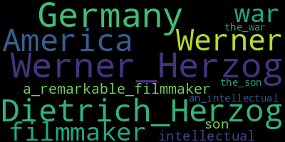

!!! note
    To run this notebook in JupyterLab, load [`examples/ex0_0.ipynb`](https://github.com/DerwenAI/textgraphs/blob/main/examples/ex0_0.ipynb)


# demo: TextGraphs + LLMs to construct a 'lemma graph'

_TextGraphs_ library is intended for iterating through a sequence of paragraphs.

## environment


```python
from IPython.display import display, HTML, Image, SVG
import pathlib

from icecream import ic
from pyinstrument import Profiler
import matplotlib.pyplot as plt
import pandas as pd
import pyvis
import spacy

import textgraphs
```


```python
%load_ext watermark
```


```python
%watermark
```

    Last updated: 2023-12-27T17:05:19.720629+01:00

    Python implementation: CPython
    Python version       : 3.10.11
    IPython version      : 8.18.1

    Compiler    : Clang 13.0.0 (clang-1300.0.29.30)
    OS          : Darwin
    Release     : 21.6.0
    Machine     : x86_64
    Processor   : i386
    CPU cores   : 8
    Architecture: 64bit


```python
%watermark --iversions
```

    sys       : 3.10.11 (v3.10.11:7d4cc5aa85, Apr  4 2023, 19:05:19) [Clang 13.0.0 (clang-1300.0.29.30)]
    pyvis     : 0.3.2
    pandas    : 2.1.4
    matplotlib: 3.8.2
    spacy     : 3.7.2
    textgraphs: 0.2.4


## parse a document

provide the source text


```python
SRC_TEXT: str = """
Werner Herzog is a remarkable filmmaker and an intellectual originally from Germany, the son of Dietrich Herzog.
After the war, Werner fled to America to become famous.
"""
```

set up the statistical stack profiling


```python
profiler: Profiler = Profiler()
profiler.start()
```

set up the `TextGraphs` pipeline


```python
tg: textgraphs.TextGraphs = textgraphs.TextGraphs(
    factory = textgraphs.PipelineFactory(
        spacy_model = textgraphs.SPACY_MODEL,
        ner = None,
        kg = textgraphs.KGWikiMedia(
            spotlight_api = textgraphs.DBPEDIA_SPOTLIGHT_API,
            dbpedia_search_api = textgraphs.DBPEDIA_SEARCH_API,
            dbpedia_sparql_api = textgraphs.DBPEDIA_SPARQL_API,
    		wikidata_api = textgraphs.WIKIDATA_API,
            min_alias = textgraphs.DBPEDIA_MIN_ALIAS,
            min_similarity = textgraphs.DBPEDIA_MIN_SIM,
        ),
        infer_rels = [
    		textgraphs.InferRel_OpenNRE(
                model = textgraphs.OPENNRE_MODEL,
                max_skip = textgraphs.MAX_SKIP,
                min_prob = textgraphs.OPENNRE_MIN_PROB,
    		),
            textgraphs.InferRel_Rebel(
                lang = "en_XX",
                mrebel_model = textgraphs.MREBEL_MODEL,
            ),
        ],
    ),
)

pipe: textgraphs.Pipeline = tg.create_pipeline(
    SRC_TEXT.strip(),
)
```

## visualize the parse results


```python
spacy.displacy.render(
    pipe.ner_doc,
    style = "ent",
    jupyter = True,
)
```


<span class="tex2jax_ignore"><div class="entities" style="line-height: 2.5; direction: ltr">
<mark class="entity" style="background: #aa9cfc; padding: 0.45em 0.6em; margin: 0 0.25em; line-height: 1; border-radius: 0.35em;">
    Werner Herzog
    <span style="font-size: 0.8em; font-weight: bold; line-height: 1; border-radius: 0.35em; vertical-align: middle; margin-left: 0.5rem">PERSON</span>
</mark>
 is a remarkable filmmaker and an intellectual originally from
<mark class="entity" style="background: #feca74; padding: 0.45em 0.6em; margin: 0 0.25em; line-height: 1; border-radius: 0.35em;">
    Germany
    <span style="font-size: 0.8em; font-weight: bold; line-height: 1; border-radius: 0.35em; vertical-align: middle; margin-left: 0.5rem">GPE</span>
</mark>
, the son of
<mark class="entity" style="background: #aa9cfc; padding: 0.45em 0.6em; margin: 0 0.25em; line-height: 1; border-radius: 0.35em;">
    Dietrich Herzog
    <span style="font-size: 0.8em; font-weight: bold; line-height: 1; border-radius: 0.35em; vertical-align: middle; margin-left: 0.5rem">PERSON</span>
</mark>
.<br>After the war,
<mark class="entity" style="background: #aa9cfc; padding: 0.45em 0.6em; margin: 0 0.25em; line-height: 1; border-radius: 0.35em;">
    Werner
    <span style="font-size: 0.8em; font-weight: bold; line-height: 1; border-radius: 0.35em; vertical-align: middle; margin-left: 0.5rem">PERSON</span>
</mark>
 fled to
<mark class="entity" style="background: #feca74; padding: 0.45em 0.6em; margin: 0 0.25em; line-height: 1; border-radius: 0.35em;">
    America
    <span style="font-size: 0.8em; font-weight: bold; line-height: 1; border-radius: 0.35em; vertical-align: middle; margin-left: 0.5rem">GPE</span>
</mark>
 to become famous.</div></span>


```python
parse_svg: str = spacy.displacy.render(
    pipe.ner_doc,
    style = "dep",
    jupyter = False,
)

display(SVG(parse_svg))
```


## collect graph elements from the parse


```python
tg.collect_graph_elements(
    pipe,
    debug = False,
)
```


```python
ic(len(tg.nodes.values()));
ic(len(tg.edges.values()));
```

    ic| len(tg.nodes.values()): 34
    ic| len(tg.edges.values()): 37


## perform entity linking


```python
tg.perform_entity_linking(
    pipe,
    debug = False,
)
```

## infer relations


```python
inferred_edges: list = await tg.infer_relations_async(
    pipe,
    debug = False,
)

inferred_edges
```


    [Edge(src_node=0, dst_node=10, kind=<RelEnum.INF: 2>, rel='https://schema.org/nationality', prob=1.0, count=1),
     Edge(src_node=15, dst_node=0, kind=<RelEnum.INF: 2>, rel='https://schema.org/children', prob=1.0, count=1),
     Edge(src_node=25, dst_node=20, kind=<RelEnum.INF: 2>, rel='https://schema.org/event', prob=1.0, count=1)]


## construct a lemma graph


```python
tg.construct_lemma_graph(
    debug = False,
)
```

## extract ranked entities


```python
tg.calc_phrase_ranks(
    pr_alpha = textgraphs.PAGERANK_ALPHA,
    debug = False,
)
```

show the resulting entities extracted from the document


```python
df: pd.DataFrame = tg.get_phrases_as_df()
df
```


<div>
<style scoped>
    .dataframe tbody tr th:only-of-type {
        vertical-align: middle;
    }

    .dataframe tbody tr th {
        vertical-align: top;
    }

    .dataframe thead th {
        text-align: right;
    }
</style>
<table border="1" class="dataframe">
  <thead>
    <tr style="text-align: right;">
      <th></th>
      <th>node_id</th>
      <th>text</th>
      <th>pos</th>
      <th>label</th>
      <th>count</th>
      <th>weight</th>
    </tr>
  </thead>
  <tbody>
    <tr>
      <th>0</th>
      <td>0</td>
      <td>Werner Herzog</td>
      <td>PROPN</td>
      <td>dbr:Werner_Herzog</td>
      <td>1</td>
      <td>0.083346</td>
    </tr>
    <tr>
      <th>1</th>
      <td>10</td>
      <td>Germany</td>
      <td>PROPN</td>
      <td>dbr:Germany</td>
      <td>1</td>
      <td>0.083232</td>
    </tr>
    <tr>
      <th>2</th>
      <td>25</td>
      <td>America</td>
      <td>PROPN</td>
      <td>dbr:United_States</td>
      <td>1</td>
      <td>0.080449</td>
    </tr>
    <tr>
      <th>3</th>
      <td>15</td>
      <td>Dietrich Herzog</td>
      <td>PROPN</td>
      <td>dbo:Person</td>
      <td>1</td>
      <td>0.078961</td>
    </tr>
    <tr>
      <th>4</th>
      <td>20</td>
      <td>war</td>
      <td>NOUN</td>
      <td>None</td>
      <td>1</td>
      <td>0.077566</td>
    </tr>
    <tr>
      <th>5</th>
      <td>22</td>
      <td>Werner</td>
      <td>PROPN</td>
      <td>dbo:Person</td>
      <td>1</td>
      <td>0.077566</td>
    </tr>
    <tr>
      <th>6</th>
      <td>4</td>
      <td>filmmaker</td>
      <td>NOUN</td>
      <td>None</td>
      <td>1</td>
      <td>0.076196</td>
    </tr>
    <tr>
      <th>7</th>
      <td>7</td>
      <td>intellectual</td>
      <td>NOUN</td>
      <td>None</td>
      <td>1</td>
      <td>0.074556</td>
    </tr>
    <tr>
      <th>8</th>
      <td>13</td>
      <td>son</td>
      <td>NOUN</td>
      <td>None</td>
      <td>1</td>
      <td>0.074556</td>
    </tr>
    <tr>
      <th>9</th>
      <td>30</td>
      <td>a remarkable filmmaker</td>
      <td>noun_chunk</td>
      <td>None</td>
      <td>1</td>
      <td>0.074556</td>
    </tr>
    <tr>
      <th>10</th>
      <td>31</td>
      <td>an intellectual</td>
      <td>noun_chunk</td>
      <td>None</td>
      <td>1</td>
      <td>0.073005</td>
    </tr>
    <tr>
      <th>11</th>
      <td>32</td>
      <td>the son</td>
      <td>noun_chunk</td>
      <td>None</td>
      <td>1</td>
      <td>0.073005</td>
    </tr>
    <tr>
      <th>12</th>
      <td>33</td>
      <td>the war</td>
      <td>noun_chunk</td>
      <td>None</td>
      <td>1</td>
      <td>0.073005</td>
    </tr>
  </tbody>
</table>
</div>


## visualize the lemma graph


```python
render: textgraphs.RenderPyVis = tg.create_render()

pv_graph: pyvis.network.Network = render.render_lemma_graph(
    debug = False,
)
```

initialize the layout parameters


```python
pv_graph.force_atlas_2based(
    gravity = -38,
    central_gravity = 0.01,
    spring_length = 231,
    spring_strength = 0.7,
    damping = 0.8,
    overlap = 0,
)

pv_graph.show_buttons(filter_ = [ "physics" ])
pv_graph.toggle_physics(True)
```


```python
pv_graph.prep_notebook()
pv_graph.show("tmp.fig01.html")
```

    tmp.fig01.html


## generate a word cloud


```python
wordcloud = render.generate_wordcloud()
display(wordcloud.to_image())
```





## cluster communities in the lemma graph

In the tutorial
<a href="https://towardsdatascience.com/how-to-convert-any-text-into-a-graph-of-concepts-110844f22a1a" target="_blank">"How to Convert Any Text Into a Graph of Concepts"</a>,
Rahul Nayak uses the
<a href="https://en.wikipedia.org/wiki/Girvan%E2%80%93Newman_algorithm"><em>girvan-newman</em></a>
algorithm to split the graph into communities, then clusters on those communities.
His approach works well for unsupervised clustering of key phrases which have been extracted from many documents.
In contrast, Nayak was working with entities extracted from "chunks" of text, not with a text graph.


```python
render.draw_communities();
```


## statistical stack profile instrumentation


```python
profiler.stop()
```


    <pyinstrument.session.Session at 0x13a199450>


```python
profiler.print()
```


      _     ._   __/__   _ _  _  _ _/_   Recorded: 17:05:19  Samples:  10788
     /_//_/// /_\ / //_// / //_'/ //     Duration: 48.729    CPU time: 70.957
    /   _/                      v4.6.1

    Program: /Users/paco/src/textgraphs/venv/lib/python3.10/site-packages/ipykernel_launcher.py -f /Users/paco/Library/Jupyter/runtime/kernel-a6be766a-c198-49dd-89ee-b098a2aea2cc.json

    48.729 _UnixSelectorEventLoop._run_once  asyncio/base_events.py:1832
    └─ 48.727 Handle._run  asyncio/events.py:78
          [12 frames hidden]  asyncio, ipykernel, IPython
             31.570 ZMQInteractiveShell.run_ast_nodes  IPython/core/interactiveshell.py:3391
             ├─ 17.705 <module>  ../ipykernel_14589/1708547378.py:1
             │  ├─ 13.575 InferRel_Rebel.__init__  textgraphs/rel.py:103
             │  │  └─ 13.460 pipeline  transformers/pipelines/__init__.py:531
             │  │        [39 frames hidden]  transformers, torch, <built-in>, json
             │  ├─ 3.358 PipelineFactory.__init__  textgraphs/pipe.py:319
             │  │  └─ 3.343 load  spacy/__init__.py:27
             │  │        [23 frames hidden]  spacy, en_core_web_sm, catalogue, imp...
             │  └─ 0.616 InferRel_OpenNRE.__init__  textgraphs/rel.py:33
             │     └─ 0.608 get_model  opennre/pretrain.py:126
             └─ 12.454 <module>  ../ipykernel_14589/1245857438.py:1
                └─ 12.454 TextGraphs.perform_entity_linking  textgraphs/doc.py:323
                   └─ 12.454 KGWikiMedia.perform_entity_linking  textgraphs/kg.py:244
                      ├─ 5.938 KGWikiMedia._link_kg_search_entities  textgraphs/kg.py:754
                      │  └─ 5.933 KGWikiMedia.dbpedia_search_entity  textgraphs/kg.py:510
                      │     └─ 5.854 get  requests/api.py:62
                      │           [15 frames hidden]  requests, urllib3, http, socket, ssl,...
                      ├─ 5.670 KGWikiMedia._link_spotlight_entities  textgraphs/kg.py:682
                      │  └─ 5.663 KGWikiMedia.dbpedia_search_entity  textgraphs/kg.py:510
                      │     └─ 5.608 get  requests/api.py:62
                      │           [15 frames hidden]  requests, urllib3, http, socket, ssl,...
                      └─ 0.845 KGWikiMedia._secondary_entity_linking  textgraphs/kg.py:854
                         └─ 0.845 KGWikiMedia.wikidata_search  textgraphs/kg.py:458
                            └─ 0.838 KGWikiMedia._wikidata_endpoint  textgraphs/kg.py:358
                               └─ 0.838 get  requests/api.py:62
                                     [15 frames hidden]  requests, urllib3, http, socket, ssl,...
             16.428 InferRel_Rebel.gen_triples_async  textgraphs/pipe.py:133
             ├─ 15.816 InferRel_Rebel.gen_triples  textgraphs/rel.py:223
             │  ├─ 14.194 InferRel_Rebel.tokenize_sent  textgraphs/rel.py:121
             │  │  └─ 14.191 TranslationPipeline.__call__  transformers/pipelines/text2text_generation.py:341
             │  │        [44 frames hidden]  transformers, torch, <built-in>
             │  └─ 1.621 KGWikiMedia.resolve_rel_iri  textgraphs/kg.py:299
             │     ├─ 1.109 get_entity_dict_from_api  qwikidata/linked_data_interface.py:21
             │     │     [16 frames hidden]  qwikidata, requests, urllib3, http, s...
             │     └─ 0.501 KGWikiMedia._wikidata_endpoint  textgraphs/kg.py:358
             │        └─ 0.500 get  requests/api.py:62
             │              [3 frames hidden]  requests
             └─ 0.611 InferRel_OpenNRE.gen_triples  textgraphs/rel.py:49
                └─ 0.551 KGWikiMedia.resolve_rel_iri  textgraphs/kg.py:299


## outro

_\[ more parts are in progress, getting added to this demo \]_
