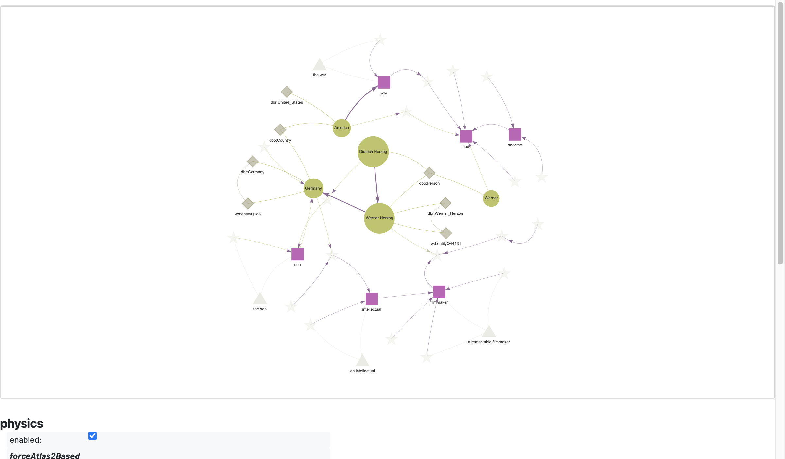
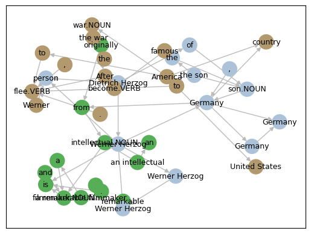
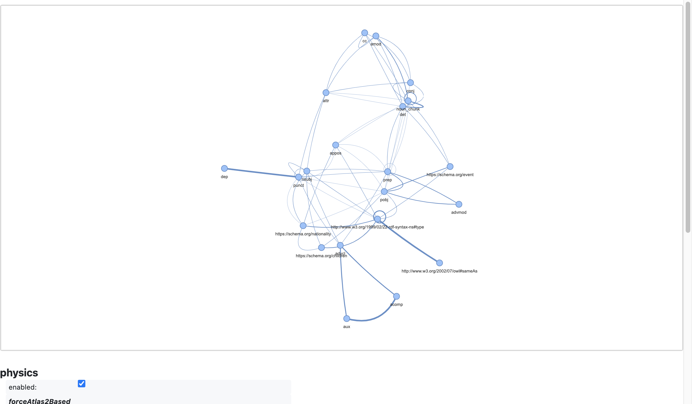

!!! note
    To run this notebook in JupyterLab, load [`examples/ex0_0.ipynb`](https://github.com/DerwenAI/textgraphs/blob/main/examples/ex0_0.ipynb)

    

# demo: TextGraphs + LLMs to construct a 'lemma graph'

_TextGraphs_ library is intended for iterating through a sequence of paragraphs.

## environment


```python
from IPython.display import display, HTML, Image, SVG
import pathlib
import typing

from icecream import ic
from pyinstrument import Profiler
import matplotlib.pyplot as plt
import pandas as pd
import pyvis
import spacy

import textgraphs
```


```python
%load_ext watermark
```


```python
%watermark
```

    Last updated: 2024-01-14T17:42:23.566161-08:00
    
    Python implementation: CPython
    Python version       : 3.10.11
    IPython version      : 8.20.0
    
    Compiler    : Clang 13.0.0 (clang-1300.0.29.30)
    OS          : Darwin
    Release     : 21.6.0
    Machine     : x86_64
    Processor   : i386
    CPU cores   : 8
    Architecture: 64bit
    


```python
%watermark --iversions
```

    pyvis     : 0.3.2
    textgraphs: 0.3.2.dev3+gaea63b7.d20240108
    sys       : 3.10.11 (v3.10.11:7d4cc5aa85, Apr  4 2023, 19:05:19) [Clang 13.0.0 (clang-1300.0.29.30)]
    matplotlib: 3.8.2
    pandas    : 2.1.4
    spacy     : 3.7.2
    


## parse a document

provide the source text


```python
SRC_TEXT: str = """                                                                                                                      
Werner Herzog is a remarkable filmmaker and an intellectual originally from Germany, the son of Dietrich Herzog.
After the war, Werner fled to America to become famous.
"""
```

set up the statistical stack profiling


```python
profiler: Profiler = Profiler()
profiler.start()
```

set up the `TextGraphs` pipeline


```python
tg: textgraphs.TextGraphs = textgraphs.TextGraphs(
    factory = textgraphs.PipelineFactory(
        spacy_model = textgraphs.SPACY_MODEL,
        ner = None,
        kg = textgraphs.KGWikiMedia(
            spotlight_api = textgraphs.DBPEDIA_SPOTLIGHT_API,
            dbpedia_search_api = textgraphs.DBPEDIA_SEARCH_API,
            dbpedia_sparql_api = textgraphs.DBPEDIA_SPARQL_API,
    		wikidata_api = textgraphs.WIKIDATA_API,
            min_alias = textgraphs.DBPEDIA_MIN_ALIAS,
            min_similarity = textgraphs.DBPEDIA_MIN_SIM,
        ),
        infer_rels = [
    		textgraphs.InferRel_OpenNRE(
                model = textgraphs.OPENNRE_MODEL,
                max_skip = textgraphs.MAX_SKIP,
                min_prob = textgraphs.OPENNRE_MIN_PROB,
    		),
            textgraphs.InferRel_Rebel(
                lang = "en_XX",
                mrebel_model = textgraphs.MREBEL_MODEL,
            ),
        ],
    ),
)

pipe: textgraphs.Pipeline = tg.create_pipeline(
    SRC_TEXT.strip(),
)
```

## visualize the parse results


```python
spacy.displacy.render(
    pipe.ner_doc,
    style = "ent",
    jupyter = True,
)
```


<span class="tex2jax_ignore"><div class="entities" style="line-height: 2.5; direction: ltr">
<mark class="entity" style="background: #aa9cfc; padding: 0.45em 0.6em; margin: 0 0.25em; line-height: 1; border-radius: 0.35em;">
    Werner Herzog
    <span style="font-size: 0.8em; font-weight: bold; line-height: 1; border-radius: 0.35em; vertical-align: middle; margin-left: 0.5rem">PERSON</span>
</mark>
 is a remarkable filmmaker and an intellectual originally from 
<mark class="entity" style="background: #feca74; padding: 0.45em 0.6em; margin: 0 0.25em; line-height: 1; border-radius: 0.35em;">
    Germany
    <span style="font-size: 0.8em; font-weight: bold; line-height: 1; border-radius: 0.35em; vertical-align: middle; margin-left: 0.5rem">GPE</span>
</mark>
, the son of 
<mark class="entity" style="background: #aa9cfc; padding: 0.45em 0.6em; margin: 0 0.25em; line-height: 1; border-radius: 0.35em;">
    Dietrich Herzog
    <span style="font-size: 0.8em; font-weight: bold; line-height: 1; border-radius: 0.35em; vertical-align: middle; margin-left: 0.5rem">PERSON</span>
</mark>
.<br>After the war, 
<mark class="entity" style="background: #aa9cfc; padding: 0.45em 0.6em; margin: 0 0.25em; line-height: 1; border-radius: 0.35em;">
    Werner
    <span style="font-size: 0.8em; font-weight: bold; line-height: 1; border-radius: 0.35em; vertical-align: middle; margin-left: 0.5rem">PERSON</span>
</mark>
 fled to 
<mark class="entity" style="background: #feca74; padding: 0.45em 0.6em; margin: 0 0.25em; line-height: 1; border-radius: 0.35em;">
    America
    <span style="font-size: 0.8em; font-weight: bold; line-height: 1; border-radius: 0.35em; vertical-align: middle; margin-left: 0.5rem">GPE</span>
</mark>
 to become famous.</div></span>


```python
parse_svg: str = spacy.displacy.render(
    pipe.ner_doc,
    style = "dep",
    jupyter = False,
)

display(SVG(parse_svg))
```


    

    


## collect graph elements from the parse


```python
tg.collect_graph_elements(
    pipe,
    debug = False,
)
```


```python
ic(len(tg.nodes.values()));
ic(len(tg.edges.values()));
```

    ic| len(tg.nodes.values()): 36
    ic| len(tg.edges.values()): 42


## perform entity linking


```python
tg.perform_entity_linking(
    pipe,
    debug = False,
)
```

## infer relations


```python
inferred_edges: list = await tg.infer_relations_async(
    pipe,
    debug = False,
)

inferred_edges
```


    [Edge(src_node=0, dst_node=10, kind=<RelEnum.INF: 2>, rel='https://schema.org/nationality', prob=1.0, count=1),
     Edge(src_node=15, dst_node=0, kind=<RelEnum.INF: 2>, rel='https://schema.org/children', prob=1.0, count=1),
     Edge(src_node=27, dst_node=22, kind=<RelEnum.INF: 2>, rel='https://schema.org/event', prob=1.0, count=1)]


## construct a lemma graph


```python
tg.construct_lemma_graph(
    debug = False,
)
```

## extract ranked entities


```python
tg.calc_phrase_ranks(
    pr_alpha = textgraphs.PAGERANK_ALPHA,
    debug = False,
)
```

show the resulting entities extracted from the document


```python
df: pd.DataFrame = tg.get_phrases_as_df()
df
```


<div>
<style scoped>
    .dataframe tbody tr th:only-of-type {
        vertical-align: middle;
    }

    .dataframe tbody tr th {
        vertical-align: top;
    }

    .dataframe thead th {
        text-align: right;
    }
</style>
<table border="1" class="dataframe">
  <thead>
    <tr style="text-align: right;">
      <th></th>
      <th>node_id</th>
      <th>text</th>
      <th>pos</th>
      <th>label</th>
      <th>count</th>
      <th>weight</th>
    </tr>
  </thead>
  <tbody>
    <tr>
      <th>0</th>
      <td>0</td>
      <td>Werner Herzog</td>
      <td>PROPN</td>
      <td>dbr:Werner_Herzog</td>
      <td>1</td>
      <td>0.080547</td>
    </tr>
    <tr>
      <th>1</th>
      <td>10</td>
      <td>Germany</td>
      <td>PROPN</td>
      <td>dbr:Germany</td>
      <td>1</td>
      <td>0.080437</td>
    </tr>
    <tr>
      <th>2</th>
      <td>15</td>
      <td>Dietrich Herzog</td>
      <td>PROPN</td>
      <td>dbo:Person</td>
      <td>1</td>
      <td>0.079048</td>
    </tr>
    <tr>
      <th>3</th>
      <td>27</td>
      <td>America</td>
      <td>PROPN</td>
      <td>dbr:United_States</td>
      <td>1</td>
      <td>0.079048</td>
    </tr>
    <tr>
      <th>4</th>
      <td>24</td>
      <td>Werner</td>
      <td>PROPN</td>
      <td>dbo:Person</td>
      <td>1</td>
      <td>0.077633</td>
    </tr>
    <tr>
      <th>5</th>
      <td>4</td>
      <td>filmmaker</td>
      <td>NOUN</td>
      <td>owl:Thing</td>
      <td>1</td>
      <td>0.076309</td>
    </tr>
    <tr>
      <th>6</th>
      <td>22</td>
      <td>war</td>
      <td>NOUN</td>
      <td>owl:Thing</td>
      <td>1</td>
      <td>0.076309</td>
    </tr>
    <tr>
      <th>7</th>
      <td>32</td>
      <td>a remarkable filmmaker</td>
      <td>noun_chunk</td>
      <td>None</td>
      <td>1</td>
      <td>0.076077</td>
    </tr>
    <tr>
      <th>8</th>
      <td>7</td>
      <td>intellectual</td>
      <td>NOUN</td>
      <td>owl:Thing</td>
      <td>1</td>
      <td>0.074725</td>
    </tr>
    <tr>
      <th>9</th>
      <td>13</td>
      <td>son</td>
      <td>NOUN</td>
      <td>owl:Thing</td>
      <td>1</td>
      <td>0.074725</td>
    </tr>
    <tr>
      <th>10</th>
      <td>33</td>
      <td>an intellectual</td>
      <td>noun_chunk</td>
      <td>None</td>
      <td>1</td>
      <td>0.074606</td>
    </tr>
    <tr>
      <th>11</th>
      <td>34</td>
      <td>the son</td>
      <td>noun_chunk</td>
      <td>None</td>
      <td>1</td>
      <td>0.074606</td>
    </tr>
    <tr>
      <th>12</th>
      <td>35</td>
      <td>the war</td>
      <td>noun_chunk</td>
      <td>None</td>
      <td>1</td>
      <td>0.074606</td>
    </tr>
  </tbody>
</table>
</div>


## visualize the lemma graph


```python
render: textgraphs.RenderPyVis = tg.create_render()

pv_graph: pyvis.network.Network = render.render_lemma_graph(
    debug = False,
)
```

initialize the layout parameters


```python
pv_graph.force_atlas_2based(
    gravity = -38,
    central_gravity = 0.01,
    spring_length = 231,
    spring_strength = 0.7,
    damping = 0.8,
    overlap = 0,
)

pv_graph.show_buttons(filter_ = [ "physics" ])
pv_graph.toggle_physics(True)
```


```python
pv_graph.prep_notebook()
pv_graph.show("tmp.fig01.html")
```

    tmp.fig01.html





## generate a word cloud


```python
wordcloud = render.generate_wordcloud()
display(wordcloud.to_image())
```


    

    


## cluster communities in the lemma graph

In the tutorial
<a href="https://towardsdatascience.com/how-to-convert-any-text-into-a-graph-of-concepts-110844f22a1a" target="_blank">"How to Convert Any Text Into a Graph of Concepts"</a>, 
Rahul Nayak uses the
<a href="https://en.wikipedia.org/wiki/Girvan%E2%80%93Newman_algorithm"><em>girvan-newman</em></a>
algorithm to split the graph into communities, then clusters on those communities.
His approach works well for unsupervised clustering of key phrases which have been extracted from many documents.
In contrast, Nayak was working with entities extracted from "chunks" of text, not with a text graph.


```python
render.draw_communities();
```


    

    


## graph of relations transform

Show a transformed graph, based on _graph of relations_ (see: `lee2023ingram`)


```python
graph: textgraphs.GraphOfRelations = textgraphs.GraphOfRelations(
    tg
)

graph.seeds()
graph.construct_gor()
```


```python
scores: typing.Dict[ tuple, float ] = graph.get_affinity_scores()
pv_graph: pyvis.network.Network = graph.render_gor_pyvis(scores)

pv_graph.force_atlas_2based(
    gravity = -38,
    central_gravity = 0.01,
    spring_length = 231,
    spring_strength = 0.7,
    damping = 0.8,
    overlap = 0,
)

pv_graph.show_buttons(filter_ = [ "physics" ])
pv_graph.toggle_physics(True)

pv_graph.prep_notebook()
pv_graph.show("tmp.fig02.html")
```

    tmp.fig02.html





*What does this transform provide?*

By using a _graph of relations_ dual representation of our graph data, first and foremost we obtain a more compact representation of the relations in the graph, and means of making inferences (e.g., _link prediction_) where there is substantially more invariance in the training data.

Also recognize that for a parse graph of a paragraph in the English language, the most interesting nodes will probably be either subjects (`nsubj`) or direct objects (`pobj`). Here in the _graph of relations_ we see illustrated how the important details from _entity linking_ tend to cluster near either `nsubj` or `pobj` entities, connected through punctuation. This is not as readily observed in the earlier visualization of the _lemma graph_.

## extract as RDF triples

Extract the nodes and edges which have IRIs, to create an "abstraction layer" as a semantic graph at a higher level of detail above the _lemma graph_:


```python
triples: str = tg.extract_rdf()
print(triples)
```

    @base <https://github.com/DerwenAI/textgraphs/ns/> .
    @prefix dbo: <http://dbpedia.org/ontology/> .
    @prefix dbr: <http://dbpedia.org/resource/> .
    @prefix schema: <https://schema.org/> .
    @prefix skos: <http://www.w3.org/2004/02/skos/core#> .
    @prefix wd_ent: <http://www.wikidata.org/entity/> .
    
    dbr:Germany skos:definition "Germany (German: Deutschland, German pronunciation: [ˈdɔʏtʃlant]), constitutionally the Federal"@en ;
        skos:prefLabel "Germany"@en .
    
    dbr:United_States skos:definition "The United States of America (USA), commonly known as the United States (U.S. or US) or America"@en ;
        skos:prefLabel "United States"@en .
    
    dbr:Werner_Herzog skos:definition "Werner Herzog (German: [ˈvɛɐ̯nɐ ˈhɛɐ̯tsoːk]; born 5 September 1942) is a German film director"@en ;
        skos:prefLabel "Werner Herzog"@en .
    
    wd_ent:Q183 skos:definition "country in Central Europe"@en ;
        skos:prefLabel "Germany"@en .
    
    wd_ent:Q44131 skos:definition "German film director, producer, screenwriter, actor and opera director"@en ;
        skos:prefLabel "Werner Herzog"@en .
    
    <entity/america_PROPN> a dbo:Country ;
        skos:prefLabel "America"@en ;
        schema:event <entity/war_NOUN> .
    
    <entity/dietrich_PROPN_herzog_PROPN> a dbo:Person ;
        skos:prefLabel "Dietrich Herzog"@en ;
        schema:children <entity/werner_PROPN_herzog_PROPN> .
    
    <entity/filmmaker_NOUN> skos:prefLabel "filmmaker"@en .
    
    <entity/intellectual_NOUN> skos:prefLabel "intellectual"@en .
    
    <entity/son_NOUN> skos:prefLabel "son"@en .
    
    <entity/werner_PROPN> a dbo:Person ;
        skos:prefLabel "Werner"@en .
    
    <entity/germany_PROPN> a dbo:Country ;
        skos:prefLabel "Germany"@en .
    
    <entity/war_NOUN> skos:prefLabel "war"@en .
    
    <entity/werner_PROPN_herzog_PROPN> a dbo:Person ;
        skos:prefLabel "Werner Herzog"@en ;
        schema:nationality <entity/germany_PROPN> .
    
    dbo:Country skos:definition "Countries, cities, states"@en ;
        skos:prefLabel "country"@en .
    
    dbo:Person skos:definition "People, including fictional"@en ;
        skos:prefLabel "person"@en .
    
    


## statistical stack profile instrumentation


```python
profiler.stop()
```


    <pyinstrument.session.Session at 0x162c12d70>


```python
profiler.print()
```

    
      _     ._   __/__   _ _  _  _ _/_   Recorded: 17:42:23  Samples:  12907
     /_//_/// /_\ / //_// / //_'/ //     Duration: 192.261   CPU time: 84.960
    /   _/                      v4.6.1
    
    Program: /Users/paco/src/textgraphs/venv/lib/python3.10/site-packages/ipykernel_launcher.py -f /Users/paco/Library/Jupyter/runtime/kernel-21c48172-c498-4e47-889b-254035b61b7d.json
    
    192.262 _UnixSelectorEventLoop._run_once  asyncio/base_events.py:1832
    └─ 192.257 Handle._run  asyncio/events.py:78
          [12 frames hidden]  asyncio, ipykernel, IPython
             162.938 ZMQInteractiveShell.run_ast_nodes  IPython/core/interactiveshell.py:3394
             ├─ 136.946 <module>  ../ipykernel_85826/1245857438.py:1
             │  └─ 136.946 TextGraphs.perform_entity_linking  textgraphs/doc.py:529
             │     └─ 136.945 KGWikiMedia.perform_entity_linking  textgraphs/kg.py:306
             │        ├─ 73.530 KGWikiMedia._link_kg_search_entities  textgraphs/kg.py:932
             │        │  └─ 73.521 KGWikiMedia.dbpedia_search_entity  textgraphs/kg.py:641
             │        │     └─ 73.301 get  requests/api.py:62
             │        │           [34 frames hidden]  requests, urllib3, http, socket, ssl,...
             │        │              61.888 _SSLSocket.read  <built-in>
             │        ├─ 59.665 KGWikiMedia._link_spotlight_entities  textgraphs/kg.py:851
             │        │  └─ 59.662 KGWikiMedia.dbpedia_search_entity  textgraphs/kg.py:641
             │        │     └─ 59.598 get  requests/api.py:62
             │        │           [34 frames hidden]  requests, urllib3, http, socket, ssl,...
             │        │              48.631 _SSLSocket.read  <built-in>
             │        └─ 3.746 KGWikiMedia._secondary_entity_linking  textgraphs/kg.py:1060
             │           └─ 3.745 KGWikiMedia.wikidata_search  textgraphs/kg.py:575
             │              └─ 3.744 KGWikiMedia._wikidata_endpoint  textgraphs/kg.py:444
             │                 └─ 3.743 get  requests/api.py:62
             │                       [12 frames hidden]  requests, urllib3, <built-in>
             └─ 22.367 <module>  ../ipykernel_85826/1708547378.py:1
                ├─ 16.426 InferRel_Rebel.__init__  textgraphs/rel.py:121
                │  └─ 16.299 pipeline  transformers/pipelines/__init__.py:531
                │        [29 frames hidden]  transformers, torch, <built-in>
                ├─ 3.130 PipelineFactory.__init__  textgraphs/pipe.py:434
                │  └─ 3.111 load  spacy/__init__.py:27
                │        [6 frames hidden]  spacy, en_core_web_sm
                └─ 1.926 TextGraphs.create_pipeline  textgraphs/doc.py:98
                   └─ 1.926 PipelineFactory.create_pipeline  textgraphs/pipe.py:508
                      └─ 1.926 Pipeline.__init__  textgraphs/pipe.py:216
                         └─ 1.926 English.__call__  spacy/language.py:1016
             27.979 InferRel_Rebel.gen_triples_async  textgraphs/pipe.py:188
             └─ 26.858 InferRel_Rebel.gen_triples  textgraphs/rel.py:259
                └─ 24.972 InferRel_Rebel.tokenize_sent  textgraphs/rel.py:145
                   └─ 24.952 TranslationPipeline.__call__  transformers/pipelines/text2text_generation.py:341
                         [41 frames hidden]  transformers, torch, <built-in>
    
    


## outro

_\[ more parts are in progress, getting added to this demo \]_
