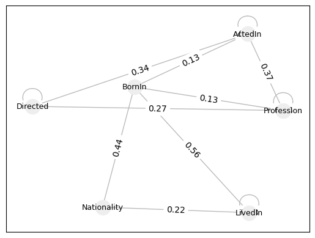
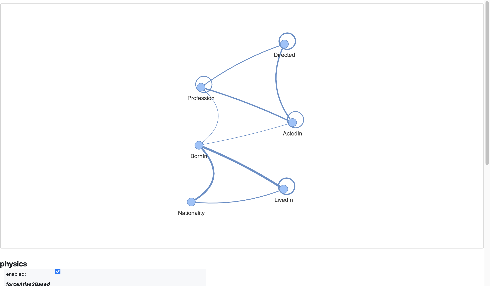

!!! note
    To run this notebook in JupyterLab, load [`examples/ex1_0.ipynb`](https://github.com/DerwenAI/textgraphs/blob/main/examples/ex1_0.ipynb)

    

# reproduce results from the "InGram" paper

This is an attempt to reproduce the _graph of relations_ example given in `lee2023ingram`

## environment


```python
import os
import pathlib
import typing

from icecream import ic
from pyinstrument import Profiler
import matplotlib.pyplot as plt
import pandas as pd
import pyvis

import textgraphs
```


```python
%load_ext watermark
```


```python
%watermark
```

    Last updated: 2024-01-16T17:35:45.550539-08:00
    
    Python implementation: CPython
    Python version       : 3.10.11
    IPython version      : 8.20.0
    
    Compiler    : Clang 13.0.0 (clang-1300.0.29.30)
    OS          : Darwin
    Release     : 21.6.0
    Machine     : x86_64
    Processor   : i386
    CPU cores   : 8
    Architecture: 64bit
    


```python
%watermark --iversions
```

    matplotlib: 3.8.2
    pandas    : 2.1.4
    pyvis     : 0.3.2
    textgraphs: 0.5.0
    sys       : 3.10.11 (v3.10.11:7d4cc5aa85, Apr  4 2023, 19:05:19) [Clang 13.0.0 (clang-1300.0.29.30)]
    


## load example graph

load from a JSON file which replicates the data for the "Figure 3" example


```python
graph: textgraphs.GraphOfRelations = textgraphs.GraphOfRelations(
    textgraphs.SimpleGraph()
)

ingram_path: pathlib.Path = pathlib.Path(os.getcwd()) / "ingram.json"

graph.load_ingram(
    ingram_path,
    debug = False,
)
```

set up the statistical stack profiling


```python
profiler: Profiler = Profiler()
profiler.start()
```

## decouple graph edges into "seeds"


```python
graph.seeds(
    debug = True,
)
```

    
    --- triples in source graph ---


    ic| edge.src_node: 0, rel_id: 1, edge.dst_node: 1
    ic| edge.src_node: 0, rel_id: 0, edge.dst_node: 2
    ic| edge.src_node: 0, rel_id: 0, edge.dst_node: 3
    ic| edge.src_node: 4, rel_id: 2, edge.dst_node: 2
    ic| edge.src_node: 4, rel_id: 2, edge.dst_node: 3
    ic| edge.src_node: 4, rel_id: 1, edge.dst_node: 5
    ic| edge.src_node: 6, rel_id: 1, edge.dst_node: 5
    ic| edge.src_node: 6, rel_id: 2, edge.dst_node: 7
    ic| edge.src_node: 6, rel_id: 4, edge.dst_node: 8
    ic| edge.src_node: 9, 

     Steven_Spielberg Profession Director
     Steven_Spielberg Directed Catch_Me_If_Can
     Steven_Spielberg Directed Saving_Private_Ryan
     Tom_Hanks ActedIn Catch_Me_If_Can
     Tom_Hanks ActedIn Saving_Private_Ryan
     Tom_Hanks Profession Actor
     Mark_Hamil Profession Actor
     Mark_Hamil ActedIn Star_Wars
     Mark_Hamil BornIn California


    rel_id: 5, edge.dst_node: 10
    ic| edge.src_node: 9, rel_id: 4, edge.dst_node: 10
    ic| edge.src_node: 9, rel_id: 3, edge.dst_node: 8
    ic| edge.src_node: 11, rel_id: 4, edge.dst_node: 12
    ic| edge.src_node: 11, rel_id: 3, edge.dst_node: 12
    ic| edge.src_node: 11, rel_id: 3, edge.dst_node: 8


     Brad_Pitt Nationality USA
     Brad_Pitt BornIn USA
     Brad_Pitt LivedIn California
     Clint_Eastwood BornIn San_Francisco
     Clint_Eastwood LivedIn San_Francisco
     Clint_Eastwood LivedIn California


```python
graph.trace_source_graph()
```

    
    --- nodes in source graph ---
    n:  0, Steven_Spielberg
     head: []
     tail: [(0, 'Profession', 1), (0, 'Directed', 2), (0, 'Directed', 3)]
    n:  1, Director
     head: [(0, 'Profession', 1)]
     tail: []
    n:  2, Catch_Me_If_Can
     head: [(0, 'Directed', 2), (4, 'ActedIn', 2)]
     tail: []
    n:  3, Saving_Private_Ryan
     head: [(0, 'Directed', 3), (4, 'ActedIn', 3)]
     tail: []
    n:  4, Tom_Hanks
     head: []
     tail: [(4, 'ActedIn', 2), (4, 'ActedIn', 3), (4, 'Profession', 5)]
    n:  5, Actor
     head: [(4, 'Profession', 5), (6, 'Profession', 5)]
     tail: []
    n:  6, Mark_Hamil
     head: []
     tail: [(6, 'Profession', 5), (6, 'ActedIn', 7), (6, 'BornIn', 8)]
    n:  7, Star_Wars
     head: [(6, 'ActedIn', 7)]
     tail: []
    n:  8, California
     head: [(6, 'BornIn', 8), (9, 'LivedIn', 8), (11, 'LivedIn', 8)]
     tail: []
    n:  9, Brad_Pitt
     head: []
     tail: [(9, 'Nationality', 10), (9, 'BornIn', 10), (9, 'LivedIn', 8)]
    n: 10, USA
     head: [(9, 'Nationality', 10), (9, 'BornIn', 10)]
     tail: []
    n: 11, Clint_Eastwood
     head: []
     tail: [(11, 'BornIn', 12), (11, 'LivedIn', 12), (11, 'LivedIn', 8)]
    n: 12, San_Francisco
     head: [(11, 'BornIn', 12), (11, 'LivedIn', 12)]
     tail: []
    
    --- edges in source graph ---
    e:  0, Directed
    e:  1, Profession
    e:  2, ActedIn
    e:  3, LivedIn
    e:  4, BornIn
    e:  5, Nationality


## construct a _graph of relations_

Transform the graph data into _graph of relations_


```python
graph.construct_gor(
	debug = True,
)
```

    ic| node_id: 0, len(seeds

    
    --- transformed triples ---


    ): 3
    ic| trans_arc: TransArc(pair_key=(0, 1),
                            a_rel=1,
                            b_rel=0,
                            node_id=0,
                            a_dir=<RelDir.TAIL: 1>,
                            b_dir=<RelDir.TAIL: 1>)
    ic| trans_arc: TransArc(pair_key=(0, 1),
                            a_rel=1,
                            b_rel=0,
                            node_id=0,
                            a_dir=<RelDir.TAIL: 1>,
                            b_dir=<RelDir.TAIL: 1>)
    ic| trans_arc: TransArc(pair_key=(0, 0),
                            a_rel=0,
                            b_rel=0,
                            node_id=0,
                            a_dir=<RelDir

     (0, 1) Profession.tail Steven_Spielberg Directed.tail
    
     (0, 1) Profession.tail Steven_Spielberg Directed.tail
    
     (0, 0) Directed.tail Steven_Spielberg Directed.tail


    .TAIL: 1>,
                            b_dir=<RelDir.TAIL: 1>)
    ic| node_id: 1, len(seeds

    


    ): 1
    ic| node_id: 2, len(seeds): 2
    ic| trans_arc: TransArc(pair_key=(0, 2),
                            a_rel=0,
                            b_rel=2,
                            node_id=2,
                            a_dir=<RelDir.HEAD: 0>,
                            b_dir=<

     (0, 2) Directed.head Catch_Me_If_Can ActedIn.head


    RelDir.HEAD: 0>)
    ic| node_id: 3, len(seeds): 2
    ic| trans_arc: TransArc(pair_key=(0, 2),
                            a_rel=0,
                            b_rel=2,
                            node_id=3,
                            a_dir=<RelDir.HEAD: 0>,
                            b_dir=<RelDir.HEAD: 0>)
    ic| node_id

    
     (0, 2) Directed.head Saving_Private_Ryan ActedIn.head
    


    : 4, len(seeds): 3
    ic| trans_arc: TransArc(pair_key=(2, 2),
                            a_rel=2,
                            b_rel=2,
                            node_id=4,
                            a_dir=<RelDir.TAIL: 1>,
                            b_dir=<RelDir.TAIL: 1>)
    ic| trans_arc: TransArc(pair_key=(1, 2),
                            a_rel=2,
                            b_rel=1,
                            node_id=4,
                            a_dir=<RelDir.TAIL: 1>,
                            b_dir=<RelDir.TAIL: 1>)
    ic| trans_arc: TransArc(pair_key=(1, 2)

     (2, 2) ActedIn.tail Tom_Hanks ActedIn.tail
    
     (1, 2) ActedIn.tail Tom_Hanks Profession.tail
    
     (1, 2) ActedIn.tail Tom_Hanks Profession.tail


    ,
                            a_rel=2,
                            b_rel=1,
                            node_id=4,
                            a_dir=<RelDir.TAIL: 1>,
                            b_dir=<RelDir.TAIL: 1>)
    ic|

    


     node_id: 5, len(seeds): 2
    ic| trans_arc: TransArc(pair_key=(1, 1),
                            a_rel=1,
                            b_rel=1,
                            

     (1, 1) Profession.head Actor Profession.head


    node_id=5,
                            a_dir=<RelDir.HEAD: 0>,
                            b_dir=<RelDir.HEAD: 0>)
    ic| node_id: 6, len(seeds): 3
    ic| trans_arc: TransArc(pair_key=(1, 2),
                            a_rel=1,
                            b_rel=2,
                            node_id=6,
                            a_dir=<RelDir.TAIL: 1>,
                            b_dir=<RelDir.TAIL: 

    
     (1, 2) Profession.tail Mark_Hamil ActedIn.tail


    1>)
    ic| trans_arc: TransArc(pair_key=(1, 4),
                            a_rel=1,
                            b_rel=4,
                            node_id=6,
                            a_dir

    
     (1, 4) Profession.tail Mark_Hamil BornIn.tail


    =<RelDir.TAIL: 1>,
                            b_dir=<RelDir.TAIL: 1>)
    ic| trans_arc: TransArc(pair_key=(2, 4),
                            a_rel=2,
                            b_rel=4,
                            node_id=6,


    
     (2, 4) ActedIn.tail Mark_Hamil BornIn.tail


                            a_dir=<RelDir.TAIL: 1>,
                            b_dir=<RelDir.TAIL: 1>)
    ic| node_id: 7, len(seeds): 1
    ic| node_id: 8, len(seeds): 3
    ic| trans_arc: TransArc(pair_key=(3, 4),
                            a_rel=4,
                            b_rel=3,
                            node_id=8,
                            a_dir=<RelDir.HEAD: 0>,
                            b_dir=<RelDir.HEAD:

    
     (3, 4) BornIn.head California LivedIn.head


     0>)
    ic| trans_arc: TransArc(pair_key=(3, 4),
                            a_rel=4,
                            b_rel=3,
                            node_id=8,
                            a_dir=<RelDir.HEAD: 0>,
                            b_dir=<RelDir.HEAD: 0>)
    ic| trans_arc: TransArc(pair_key=(3, 3),
                            a_rel=3,
                            b_rel=3,
                            node_id=8,
                            a_dir=<RelDir.HEAD: 0>,
                            b_dir=<RelDir.HEAD: 0>)
    ic| node_id: 9, len(seeds): 3
    ic

    
     (3, 4) BornIn.head California LivedIn.head
    
     (3, 3) LivedIn.head California LivedIn.head
    
     (4, 5) Nationality.tail Brad_Pitt BornIn.tail


    | trans_arc: TransArc(pair_key=(4, 5),
                            a_rel=5,
                            b_rel=4,
                            node_id=9,
                            a_dir=<RelDir.TAIL: 1>,
                            b_dir=<RelDir.TAIL: 1>)
    ic| trans_arc: TransArc(pair_key=(3, 5),
                            a_rel=5,
                            b_rel=3,
                            node_id=9,
                            a_dir=<RelDir.TAIL: 1>,
                            b_dir=<

    
     (3, 5) Nationality.tail Brad_Pitt LivedIn.tail


    RelDir.TAIL: 1>)
    ic| trans_arc: TransArc(pair_key=(3, 4),
                            a_rel=4,
                            b_rel=3,
                            node_id=9,
                            a_dir=<RelDir.TAIL: 1>,
                            b_dir=<RelDir.TAIL: 1>)
    ic| node_id: 10, len(seeds): 2
    ic| trans_arc: TransArc(pair_key=(4, 5),
                            a_rel=5,
                            b_rel=4,
                            node_id=10,
                            a_dir=<RelDir.HEAD: 0>,
                            b_dir=<RelDir.HEAD: 0>)
    ic| node_id: 11, len(seeds): 3
    ic| trans_arc: TransArc(pair_key=(3, 

    
     (3, 4) BornIn.tail Brad_Pitt LivedIn.tail
    
     (4, 5) Nationality.head USA BornIn.head
    
     (3, 4) BornIn.tail Clint_Eastwood LivedIn.tail


    4),
                            a_rel=4,
                            b_rel=3,
                            node_id=11,
                            a_dir=<RelDir.TAIL: 1>,
                            b_dir=<RelDir.TAIL: 1>)
    ic

    
     (3, 4) BornIn.tail Clint_Eastwood LivedIn.tail


    | trans_arc: TransArc(pair_key=(3, 4),
                            a_rel=4,
                            b_rel=3,
                            node_id=11,
                            a_dir=<RelDir.TAIL: 1>,
                            b_dir=<RelDir.TAIL: 1>)
    ic| trans_arc: TransArc(pair_key=(3, 3),
                            a_rel=3,
                            b_rel=3,
                            node_id=11,
                            a_dir=<RelDir.TAIL: 1>,
                            b_dir=<RelDir.TAIL: 1>)
    ic| node_id: 12, len(seeds

    
     (3, 3) LivedIn.tail Clint_Eastwood LivedIn.tail
    


    ): 2
    ic| trans_arc: TransArc(pair_key=(3, 4),
                            a_rel=4,
                            b_rel=3,
                            node_id=12,
                            a_dir=<RelDir.HEAD: 0>,
                            b_dir=<RelDir.HEAD: 0>)


     (3, 4) BornIn.head San_Francisco LivedIn.head
    


```python
scores: typing.Dict[ tuple, float ] = graph.get_affinity_scores(
    debug = True,
)
```

    
    --- collect shared entity tallies ---
    0 Directed
     h: 4 dict_items([(2, 4.0)])
     t: 6 dict_items([(0, 3.0), (1, 3.0)])
    1 Profession
     h: 3 dict_items([(1, 3.0)])
     t: 10 dict_items([(0, 3.0), (2, 5.0), (4, 2.0)])
    2 ActedIn
     h: 4 dict_items([(0, 4.0)])
     t: 10 dict_items([(1, 5.0), (2, 3.0), (4, 2.0)])
    3 LivedIn
     h: 8 dict_items([(3, 3.0), (4, 5.0)])
     t: 10 dict_items([(3, 3.0), (4, 5.0), (5, 2.0)])
    4 BornIn
     h: 7 dict_items([(3, 5.0), (5, 2.0)])
     t: 11 dict_items([(1, 2.0), (2, 2.0), (3, 5.0), (5, 2.0)])
    5 Nationality
     h: 2 dict_items([(4, 2.0)])
     t: 4 dict_items([(3, 2.0), (4, 2.0)])


```python
ic(scores);
```

    ic| scores: {(0, 0): 0.3,
                 (0, 1): 0.2653846153846154,
                 (0, 2): 0.34285714285714286,
                 (1, 1): 0.23076923076923078,
                 (1, 2): 0.3708791208791209,
                 (1, 4): 0.13247863247863248,
                 (2, 2): 0.21428571428571427,
                 (2, 4): 0.12698412698412698,
                 (3, 3): 0.3333333333333333,
                 (3, 4): 0.5555555555555556,
                 (3, 5): 0.2222222222222222,
                 (4, 5): 0.4444444444444444}


## visualize the transform results


```python
graph.render_gor_plt(scores)
plt.show()
```


    

    


```python
pv_graph: pyvis.network.Network = graph.render_gor_pyvis(scores)

pv_graph.force_atlas_2based(
    gravity = -38,
    central_gravity = 0.01,
    spring_length = 231,
    spring_strength = 0.7,
    damping = 0.8,
    overlap = 0,
)

pv_graph.show_buttons(filter_ = [ "physics" ])
pv_graph.toggle_physics(True)

pv_graph.prep_notebook()
pv_graph.show("tmp.fig03.html")
```

    tmp.fig03.html





## analysis

As the results below above illustrate, the computed _affinity scores_ differ from what is published in `lee2023ingram`. After trying several different variations of interpretation for the paper's descriptions, the current approach provides the closest approximation that we have obtained.


```python
df: pd.DataFrame = graph.trace_metrics(scores)
df
```


<div>
<style scoped>
    .dataframe tbody tr th:only-of-type {
        vertical-align: middle;
    }

    .dataframe tbody tr th {
        vertical-align: top;
    }

    .dataframe thead th {
        text-align: right;
    }
</style>
<table border="1" class="dataframe">
  <thead>
    <tr style="text-align: right;">
      <th></th>
      <th>pair</th>
      <th>rel_a</th>
      <th>rel_b</th>
      <th>affinity</th>
      <th>expected</th>
    </tr>
  </thead>
  <tbody>
    <tr>
      <th>0</th>
      <td>(0, 0)</td>
      <td>Directed</td>
      <td>Directed</td>
      <td>0.30</td>
      <td>NaN</td>
    </tr>
    <tr>
      <th>1</th>
      <td>(0, 1)</td>
      <td>Directed</td>
      <td>Profession</td>
      <td>0.27</td>
      <td>0.22</td>
    </tr>
    <tr>
      <th>2</th>
      <td>(0, 2)</td>
      <td>Directed</td>
      <td>ActedIn</td>
      <td>0.34</td>
      <td>0.50</td>
    </tr>
    <tr>
      <th>3</th>
      <td>(1, 1)</td>
      <td>Profession</td>
      <td>Profession</td>
      <td>0.23</td>
      <td>NaN</td>
    </tr>
    <tr>
      <th>4</th>
      <td>(1, 2)</td>
      <td>Profession</td>
      <td>ActedIn</td>
      <td>0.37</td>
      <td>0.33</td>
    </tr>
    <tr>
      <th>5</th>
      <td>(1, 4)</td>
      <td>Profession</td>
      <td>BornIn</td>
      <td>0.13</td>
      <td>0.11</td>
    </tr>
    <tr>
      <th>6</th>
      <td>(2, 2)</td>
      <td>ActedIn</td>
      <td>ActedIn</td>
      <td>0.21</td>
      <td>NaN</td>
    </tr>
    <tr>
      <th>7</th>
      <td>(2, 4)</td>
      <td>ActedIn</td>
      <td>BornIn</td>
      <td>0.13</td>
      <td>0.11</td>
    </tr>
    <tr>
      <th>8</th>
      <td>(3, 3)</td>
      <td>LivedIn</td>
      <td>LivedIn</td>
      <td>0.33</td>
      <td>NaN</td>
    </tr>
    <tr>
      <th>9</th>
      <td>(3, 4)</td>
      <td>LivedIn</td>
      <td>BornIn</td>
      <td>0.56</td>
      <td>0.81</td>
    </tr>
    <tr>
      <th>10</th>
      <td>(3, 5)</td>
      <td>LivedIn</td>
      <td>Nationality</td>
      <td>0.22</td>
      <td>0.11</td>
    </tr>
    <tr>
      <th>11</th>
      <td>(4, 5)</td>
      <td>BornIn</td>
      <td>Nationality</td>
      <td>0.44</td>
      <td>0.36</td>
    </tr>
  </tbody>
</table>
</div>


## statistical stack profile instrumentation


```python
profiler.stop()
```


    <pyinstrument.session.Session at 0x1416bc7f0>


```python
profiler.print()
```

    
      _     ._   __/__   _ _  _  _ _/_   Recorded: 17:35:45  Samples:  2526
     /_//_/// /_\ / //_// / //_'/ //     Duration: 3.799     CPU time: 4.060
    /   _/                      v4.6.1
    
    Program: /Users/paco/src/textgraphs/venv/lib/python3.10/site-packages/ipykernel_launcher.py -f /Users/paco/Library/Jupyter/runtime/kernel-27f0c564-73f8-45ab-9f64-8b064ae1de10.json
    
    3.799 IPythonKernel.dispatch_queue  ipykernel/kernelbase.py:525
    └─ 3.791 IPythonKernel.process_one  ipykernel/kernelbase.py:511
          [10 frames hidden]  ipykernel, IPython
             3.680 ZMQInteractiveShell.run_ast_nodes  IPython/core/interactiveshell.py:3394
             ├─ 2.176 <module>  ../ipykernel_4421/3358887201.py:1
             │  └─ 2.176 GraphOfRelations.construct_gor  textgraphs/gor.py:311
             │     ├─ 1.607 IceCreamDebugger.__call__  icecream/icecream.py:204
             │     │     [17 frames hidden]  icecream, colorama, ipykernel, thread...
             │     │        1.078 lock.acquire  <built-in>
             │     └─ 0.566 GraphOfRelations._transformed_triples  textgraphs/gor.py:275
             │        └─ 0.563 IceCreamDebugger.__call__  icecream/icecream.py:204
             │              [13 frames hidden]  icecream, colorama, ipykernel, zmq, t...
             ├─ 0.866 <module>  ../ipykernel_4421/4061275008.py:1
             │  └─ 0.866 GraphOfRelations.seeds  textgraphs/gor.py:197
             │     └─ 0.865 IceCreamDebugger.__call__  icecream/icecream.py:204
             │           [42 frames hidden]  icecream, inspect, posixpath, <built-...
             ├─ 0.362 <module>  ../ipykernel_4421/559531165.py:1
             │  ├─ 0.234 show  matplotlib/pyplot.py:482
             │  │     [32 frames hidden]  matplotlib, matplotlib_inline, IPytho...
             │  └─ 0.128 GraphOfRelations.render_gor_plt  textgraphs/gor.py:522
             │     └─ 0.104 draw_networkx  networkx/drawing/nx_pylab.py:127
             │           [6 frames hidden]  networkx, matplotlib
             ├─ 0.197 <module>  ../ipykernel_4421/1169542473.py:1
             │  └─ 0.197 IceCreamDebugger.__call__  icecream/icecream.py:204
             │        [14 frames hidden]  icecream, colorama, ipykernel, thread...
             └─ 0.041 <module>  ../ipykernel_4421/2247466716.py:1
    
    


## outro

_\[ more parts are in progress, getting added to this demo \]_
