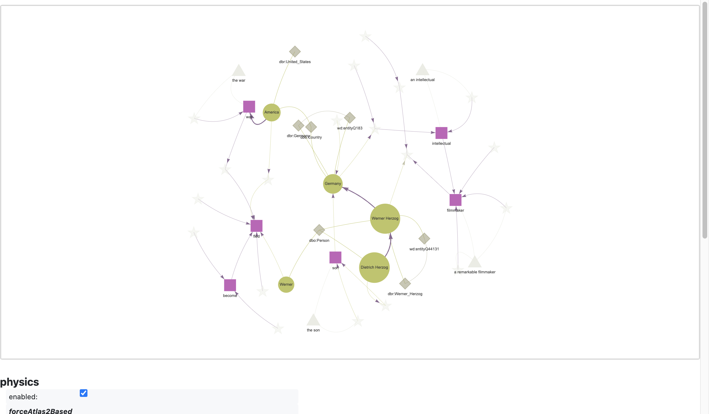

!!! note
    To run this notebook in JupyterLab, load [`examples/ex2_0.ipynb`](https://github.com/DerwenAI/textgraphs/blob/main/examples/ex2_0.ipynb)

    

# bootstrap the _lemma graph_ with RDF triples

Show how to bootstrap definitions in a _lemma graph_ by loading RDF, e.g., for synonyms.

## environment


```python
from icecream import ic
from pyinstrument import Profiler
import pyvis

import textgraphs
```


```python
%load_ext watermark
```


```python
%watermark
```

    Last updated: 2024-01-14T17:34:16.110051-08:00
    
    Python implementation: CPython
    Python version       : 3.10.11
    IPython version      : 8.20.0
    
    Compiler    : Clang 13.0.0 (clang-1300.0.29.30)
    OS          : Darwin
    Release     : 21.6.0
    Machine     : x86_64
    Processor   : i386
    CPU cores   : 8
    Architecture: 64bit
    


```python
%watermark --iversions
```

    sys       : 3.10.11 (v3.10.11:7d4cc5aa85, Apr  4 2023, 19:05:19) [Clang 13.0.0 (clang-1300.0.29.30)]
    textgraphs: 0.3.2.dev3+gaea63b7.d20240108
    pyvis     : 0.3.2
    


## load the bootstrap definitions

Define the bootstrap RDF triples in N3/Turtle format: we define an entity `Werner` as a synonym for `Werner Herzog` by using the [`skos:broader`](https://www.w3.org/TR/skos-reference/#semantic-relations) relation. Keep in mind that this entity may also refer to other Werners...


```python
TTL_STR: str = """
@base <https://github.com/DerwenAI/textgraphs/ns/> .
@prefix dbo: <http://dbpedia.org/ontology/> .
@prefix skos: <http://www.w3.org/2004/02/skos/core#> .

<entity/werner_PROPN> a dbo:Person ;
    skos:prefLabel "Werner"@en .

<entity/werner_PROPN_herzog_PROPN> a dbo:Person ;
    skos:prefLabel "Werner Herzog"@en.

dbo:Person skos:definition "People, including fictional"@en ;
    skos:prefLabel "person"@en .

<entity/werner_PROPN_herzog_PROPN> skos:broader <entity/werner_PROPN> .
"""
```

Provide the source text


```python
SRC_TEXT: str = """                                                                                                                      
Werner Herzog is a remarkable filmmaker and an intellectual originally from Germany, the son of Dietrich Herzog.
After the war, Werner fled to America to become famous.
"""
```

set up the statistical stack profiling


```python
profiler: Profiler = Profiler()
profiler.start()
```

set up the `TextGraphs` pipeline


```python
tg: textgraphs.TextGraphs = textgraphs.TextGraphs(
    factory = textgraphs.PipelineFactory(
        kg = textgraphs.KGWikiMedia(
            spotlight_api = textgraphs.DBPEDIA_SPOTLIGHT_API,
            dbpedia_search_api = textgraphs.DBPEDIA_SEARCH_API,
            dbpedia_sparql_api = textgraphs.DBPEDIA_SPARQL_API,
    		wikidata_api = textgraphs.WIKIDATA_API,
            min_alias = textgraphs.DBPEDIA_MIN_ALIAS,
            min_similarity = textgraphs.DBPEDIA_MIN_SIM,
        ),
    ),
)
```

load the bootstrap definitions


```python
tg.load_bootstrap_ttl(
    TTL_STR,
    debug = False,
)
```

parse the input text


```python
pipe: textgraphs.Pipeline = tg.create_pipeline(
    SRC_TEXT.strip(),
)

tg.collect_graph_elements(
    pipe,
    debug = False,
)

tg.construct_lemma_graph(
    debug = False,
)
```

## visualize the lemma graph


```python
render: textgraphs.RenderPyVis = tg.create_render()

pv_graph: pyvis.network.Network = render.render_lemma_graph(
    debug = False,
)
```

initialize the layout parameters


```python
pv_graph.force_atlas_2based(
    gravity = -38,
    central_gravity = 0.01,
    spring_length = 231,
    spring_strength = 0.7,
    damping = 0.8,
    overlap = 0,
)

pv_graph.show_buttons(filter_ = [ "physics" ])
pv_graph.toggle_physics(True)
```


```python
pv_graph.prep_notebook()
pv_graph.show("tmp.fig01.html")
```

    tmp.fig01.html





Notice how the `Werner` and `Werner Herzog` nodes are now linked? This synonym from the bootstrap definitions above provided means to link more portions of the _lemma graph_ than the demo in `ex0_0` with the same input text.

## statistical stack profile instrumentation


```python
profiler.stop()
```


    <pyinstrument.session.Session at 0x15b34dfc0>


```python
profiler.print()
```

    
      _     ._   __/__   _ _  _  _ _/_   Recorded: 17:34:16  Samples:  3142
     /_//_/// /_\ / //_// / //_'/ //     Duration: 9.510     CPU time: 3.591
    /   _/                      v4.6.1
    
    Program: /Users/paco/src/textgraphs/venv/lib/python3.10/site-packages/ipykernel_launcher.py -f /Users/paco/Library/Jupyter/runtime/kernel-a4651af1-5b88-4c9e-ad8d-662f666edfc8.json
    
    9.509 IPythonKernel.dispatch_queue  ipykernel/kernelbase.py:525
    └─ 9.508 IPythonKernel.process_one  ipykernel/kernelbase.py:511
          [10 frames hidden]  ipykernel, IPython
             9.426 ZMQInteractiveShell.run_ast_nodes  IPython/core/interactiveshell.py:3394
             ├─ 5.784 <module>  ../ipykernel_84869/3257668275.py:1
             │  └─ 5.778 TextGraphs.create_pipeline  textgraphs/doc.py:98
             │     └─ 5.778 PipelineFactory.create_pipeline  textgraphs/pipe.py:508
             │        └─ 5.778 Pipeline.__init__  textgraphs/pipe.py:216
             │           └─ 5.778 English.__call__  spacy/language.py:1016
             │                 [40 frames hidden]  spacy, spacy_dbpedia_spotlight, reque...
             │                    3.428 socket.connect  <built-in>
             └─ 3.540 <module>  ../ipykernel_84869/1372904243.py:1
                └─ 3.538 PipelineFactory.__init__  textgraphs/pipe.py:434
                   └─ 3.519 load  spacy/__init__.py:27
                         [78 frames hidden]  spacy, en_core_web_sm, catalogue, imp...
    
    


## outro

_\[ more parts are in progress, getting added to this demo \]_
