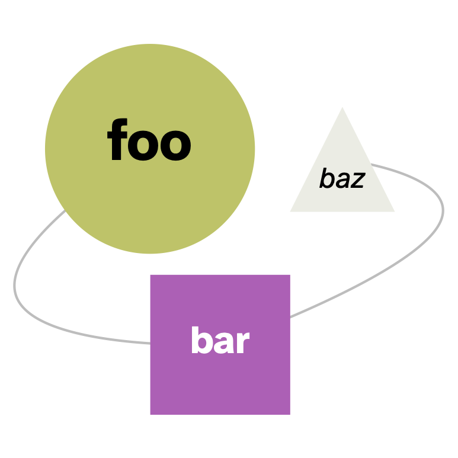

# TextGraphs: raw texts, LLMs, and KGs, oh my!

Welcome to the **TextGraphs** library...

Large language models (LLMs) come from research in natural language.
How can LLMs help improve natural language work?
In particular, how can LLMs benefit use cases that use the results of natural language parsing to build knowledge graphs?

If you've been reading the news cycle about AI, one obvious through rather naïve response might be
"Simply feed your data to ChatGPT and ask it to generate a knowledge graph."
Those who've tried to do this understand the consequences:
incredibly expensive process and poor results relative to other methods.

How else could LLMs help augment existing natural language workflows?
This ongoing project is the result of pursing that line of inquiry.
With sufficiently narrowed task focus and ample amounts of dedicated software engineering, large models can be used to augment specific _components_ of natural language workflows.
The `TextGraphs` library illustrates integrations of several different components in this category, along with use of graph queries, graph algorithms, and other tooling.
The results present a "hybrid" approach: it's not purely "generative" -- whatever that might mean.

A core assumption is to provide results which get used subsequently for expert feedback --
in other words, by leveraging some means of _human-in-the-loop_ (HITL) process.
Our guiding principle has been to create a Python library built from classes which allow for configurable, extensible pipelines.
Care has also been given to writing code that can be enhance to run concurrently (e.g., leveraging `asyncio`), using other libraries with business-friendly licenses, and paying attention to security concerns.
Note that while the `spaCy` library for NLP plays a central role here, this library is not intended to become a `spaCy` pipeline.

Based on default settings, one can use `TextGraphs` to create good means for extracting ranked key phrases from raw text --
even without using any of the additional deep learning models.

Taking a few further steps, one can generate an RDF or LPG graph from raw texts, and make use of _entity linking_, _relation extraction_, and other techniques to ground the natural language parsing in a knowledge graph with represents a particular domain.
The default examples leverage the graphs of WikiMedia: DBPedia, Wikidata, etc.

A third set of goals for `TextGraphs` is to provide a "playground" or "gym" for evaluating _graph levels of detail_ (abstraction layers for knowledge graphs) and some of the emerging notions of _foundation models_ for knowledge graphs.
Text parsing produces graphs, although the results tend to be _noisy_.
This seemed like a good opportunity to generate data for "condensing" a graph into more abstracted representations.
We condense based on patterns in the relatively noisy parse results into relatively refined knowledge graph elements.

Short of going into loads of detail in the first section of the documentation, the tokenization used in many natural language projects and related LLM research tends to throw away valuable data.
We wanted to see what might result from leveraging that data instead?
Based on what was learned, this work presents the notion of a _lemma graph_ which gets used to capture intermediate results from parsed raw text, prior to HITL feedback.
Elements extracted from _lemma graphs_ can be used subsequently to construct or augment knowledge graphs, preferably in an iterative process.

