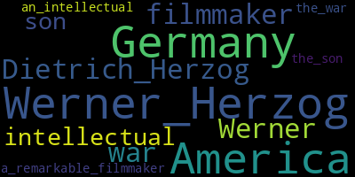
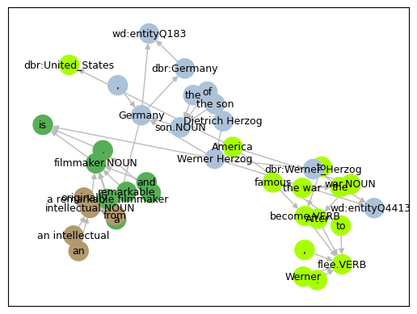

!!! note
    To run this notebook in JupyterLab, load [`examples/tutorial.ipynb`](https://github.com/DerwenAI/textgraphs/blob/main/examples/tutorial.ipynb)


# demo: TextGraphs + LLMs to construct a 'lemma graph'

_TextGraphs_ library is intended for iterating through a sequence of paragraphs.

## intro


```python
import pathlib
from IPython.display import display, HTML, Image
display(HTML(pathlib.Path("../docs/demo/blurb.1.html").read_text(encoding = "utf-8")))
```


<details>
  <summary><strong>TL;DR</strong></summary>
  <p>
    Construct a <em>lemma graph</em>, then perform <em>entity linking</em> based on:
    <code>spaCy</code>, <code>transformers</code>, <code>SpanMarkerNER</code>,
    <code>spaCy-DBpedia-Spotlight</code>, <code>REBEL</code>, <code>OpenNRE</code>,
    <code>qwikidata</code>, <code>pulp</code>
  </p>
  <p>
    In other words, this hybrid approach integrates
    <em>NLP parsing</em>, <em>LLMs</em>, <em>graph algorithms</em>, <em>semantic inference</em>, <em>operations research</em>,
    and also provides UX affordances for including <em>human-in-the-loop</em> practices.
    The following demo illustrates a small problem, and addresses a much broader class of AI problems in industry.
  </p>
  <p>
    This step is a prelude before leveraging
    <em>topological transforms</em>, <em>large language models</em>, <em>graph representation learning</em>,
    plus <em>human-in-the-loop</em> domain expertise to infer
    the nodes, edges, properties, and probabilities needed for the
    semi-automated construction of a <em>knowledge graph</em> from
    raw unstructured text sources.
  </p>
  <p>
    In addition to providing a library for production use cases,
    <code>TextGraphs</code> creates a "playground" or "gym"
    in which to prototype and evaluate abstractions based on
    <a href="https://blog.derwen.ai/graph-levels-of-detail-ea4226abba55" target="_blank">"Graph Levels Of Detail"</a>.
  </p>
  <ol>
    <li>use <code>spaCy</code> to parse a document, with <code>SpanMarkerNER</code> LLM assist</li>
    <li>add noun chunks in parallel to entities, as "candidate" phrases for subsequent HITL</li>
    <li>perform <em>entity linking</em>: <code>spaCy-DBpedia-Spotlight</code>, <code>WikiMedia API</code></li>
    <li>infer relations, plus graph inference: <code>REBEL</code>, <code>OpenNRE</code>, <code>qwikidata</code></li>
    <li>build a <em>lemma graph</em> in <code>NetworkX</code> from the parse results</li>
    <li>run a modified <code>textrank</code> algorithm plus graph analytics</li>
    <li>approximate a <em>pareto archive</em> (hypervolume) to re-rank extracted entities with <code>pulp</code></li>
    <li>visualize the <em>lemma graph</em> interactively in <code>PyVis</code></li>
    <li>cluster communities within the <em>lemma graph</em>
    <li>apply topological transforms to enhance embeddings (in progress)</li>
    <li>run graph representation learning on the <em>graph of relations</em> (in progress)</li>
  </ol>
  <p>
    ...
  </p>
  <ol start="13">
    <li>PROFIT!</li>
  </ol>
</details>


<details>
  <summary><strong>More details...</strong></summary>
  <p>
    Implementation of an LLM-augmented <code>textgraph</code> algorithm for
    constructing a <em>lemma graph</em> from raw, unstructured text source.
  </p>
  <p>
    The <code>TextGraphs</code> library is based on work developed by
    <a href="https://derwen.ai/graph" target="_blank">Derwen</a>
    in 2023 Q2 for customer apps and used in our <code>Cysoni</code>
    product.
    This demo integrates code from:
  </p>
  <ul>
    <li>
      <a href="https://github.com/tomaarsen/SpanMarkerNER/" target="_blank"><code>SpanMarkerNER</code></a>
    </li>
    <li>
      <a href="https://github.com/MartinoMensio/spacy-dbpedia-spotlight" target="_blank"><code>spaCy-DBpedia-Spotlight</code></a>
    </li>
    <li>
      <a href="https://github.com/Babelscape/rebel" target="_blank"><code>REBEL</code></a>
    </li>
    <li>
      <a href="https://github.com/thunlp/OpenNRE/" target="_blank"><code>OpenNRE</code></a>
    </li>
    <li>
      <a href="https://github.com/kensho-technologies/qwikidata" target="_blank"><code>qwikidata</code></a>
    </li>
    <li>
      <a href="https://github.com/coin-or/pulp" target="_blank"><code>pulp</code></a>
    </li>
    <li>
      <a href="https://spacy.io/" target="_blank"><code>spaCy</code></a>
    </li>
    <li>
      <a href="https://huggingface.co/docs/transformers/index" target="_blank"><code>HF transformers</code></a>
    </li>
    <li>
      <a href="https://github.com/DerwenAI/pytextrank/" target="_blank"><code>PyTextRank</code></a>
    </li>
  </ul>

  <p>
    For more details about this approach, see these talks:
  </p>
  <ul>
    <li>
      <a href="https://derwen.ai/s/mqqm" target="_blank">"Language, Graphs, and AI in Industry"</a>
      <br/>
      <strong>Paco Nathan</strong>, K1st World (2023-10-11)
    </li>
    <li>
      <a href="https://derwen.ai/s/rhvg" target="_blank">"Language Tools for Creators"</a>
      <br/>
      <strong>Paco Nathan</strong>, FOSSY (2023-07-13)
    </li>
  </ul>

  <p>
    Other good tutorials (during 2023) which include related material:
  </p>
  <ul>
    <li>
      <a href="https://youtu.be/C9p7suS-NGk?si=7Ohq3BV654ia2Im4" target="_blank">"Natural Intelligence is All You Need™"</a>
      <br/>
      <strong>Vincent Warmerdam</strong>, PyData Amsterdam (2023-09-15)
    </li>
    <li>
      <a href="https://towardsdatascience.com/how-to-convert-any-text-into-a-graph-of-concepts-110844f22a1a" target="_blank">"How to Convert Any Text Into a Graph of Concepts"</a>
      <br/>
      <strong>Rahul Nayak</strong>, <em>Towards Data Science</em> (2023-11-09)
    </li>
    <li>
      <a href="https://medium.com/@nizami_muhammad/extracting-relation-from-sentence-using-llm-597d0c0310a8" target="_blank">"Extracting Relation from Sentence using LLM"</a>
      <br/>
      <strong>Muhammad Nizami</strong> <em>Medium</em> (2023-11-15)
    <li>
  </ul>
</details>


<details>
  <summary><strong>Bibliography...</strong></summary>

  <p>
    "Automatic generation of hypertext knowledge bases"
    <br/>
    <strong>Udo Hahn</strong>, <strong>Ulrich Reimer</strong>
    <br/>
    <em>ACM SIGOIS</em> 9:2 (1988-04-01)
    <br/>
    <a href="https://doi.org/10.1145/966861.45429" target="_blank">https://doi.org/10.1145/966861.45429</a>
  </p>
  <blockquote>
    The condensation process transforms the text representation structures resulting from the text parse into a more abstract thematic description of what the text is about, filtering out irrelevant knowledge structures and preserving only the most salient concepts.
  </blockquote>

  <p>
    <em>Graph Representation Learning</em>
    <br/>
    <strong>William Hamilton</strong>
    <br/>
    Morgan and Claypool (pre-print 2020)
    <br/>
    <a href="https://www.cs.mcgill.ca/~wlh/grl_book/" target="_blank">https://www.cs.mcgill.ca/~wlh/grl_book/</a>
  </p>
  <blockquote>
    A brief but comprehensive introduction to graph representation learning, including methods for embedding graph data, graph neural networks, and deep generative models of graphs.
  </blockquote>

  <p>
    "RED<sup>FM</sup>: a Filtered and Multilingual Relation Extraction Dataset"
    <br/>
    <strong>Pere-Lluís Huguet Cabot</strong>, <strong>Simone Tedeschi</strong>, <strong>Axel-Cyrille Ngonga Ngomo</strong>, <strong>Roberto Navigli</strong>
    <br/>
    <em>ACL</em> (2023-06-19)
    <br/>
    <a href="https://arxiv.org/abs/2306.09802" target="_blank">https://arxiv.org/abs/2306.09802</a>
  </p>
  <blockquote>
    Relation Extraction (RE) is a task that identifies relationships between entities in a text, enabling the acquisition of relational facts and bridging the gap between natural language and structured knowledge. However, current RE models often rely on small datasets with low coverage of relation types, particularly when working with languages other than English. In this paper, we address the above issue and provide two new resources that enable the training and evaluation of multilingual RE systems.
  </blockquote>

  <p>
    "InGram: Inductive Knowledge Graph Embedding via Relation Graphs"
    <br/>
    <strong>Jaejun Lee</strong>, <strong>Chanyoung Chung</strong>, <strong>Joyce Jiyoung Whang</strong>
    <br/>
    <em>ICML</em> (2023–08–17)
    <br/>
    <a href="https://arxiv.org/abs/2305.19987" target="_blank">https://arxiv.org/abs/2305.19987</a>
  </p>
  <blockquote>
    In this paper, we propose an INductive knowledge GRAph eMbedding method, InGram, that can generate embeddings of new relations as well as new entities at inference time.
  </blockquote>

  <p>
    "TextRank: Bringing Order into Text"
    <br/>
    <strong>Rada Mihalcea</strong>, <strong>Paul Tarau</strong>
    <br/>
    <em>EMNLP</em> (2004-07-25)
    <br/>
    <a href="https://aclanthology.org/W04-3252" target="_blank">https://aclanthology.org/W04-3252</a>
  </p>
  <blockquote>
    In this paper, the authors introduce TextRank, a graph-based ranking model for text processing, and show how this model can be successfully used in natural language applications.
  </blockquote>

</details>

<hr/>


## environment


```python
from icecream import ic
from pyinstrument import Profiler
import matplotlib.pyplot as plt
import pandas as pd
import pyvis
import spacy

import textgraphs
```


```python
%load_ext watermark
```


```python
%watermark
```

    Last updated: 2023-12-25T12:24:44.586037+01:00

    Python implementation: CPython
    Python version       : 3.10.11
    IPython version      : 8.18.1

    Compiler    : Clang 13.0.0 (clang-1300.0.29.30)
    OS          : Darwin
    Release     : 21.6.0
    Machine     : x86_64
    Processor   : i386
    CPU cores   : 8
    Architecture: 64bit


```python
%watermark --iversions
```

    pandas    : 2.1.4
    pyvis     : 0.3.2
    textgraphs: 0.1.2
    matplotlib: 3.8.2
    spacy     : 3.7.2
    sys       : 3.10.11 (v3.10.11:7d4cc5aa85, Apr  4 2023, 19:05:19) [Clang 13.0.0 (clang-1300.0.29.30)]


## parse a document

provide the source text


```python
SRC_TEXT: str = """
Werner Herzog is a remarkable filmmaker and an intellectual originally from Germany, the son of Dietrich Herzog.
After the war, Werner fled to America to become famous.
"""
```

set up the statistical stack profiling


```python
profiler: Profiler = Profiler()
profiler.start()
```

set up the `TextGraphs` pipeline


```python
tg: textgraphs.TextGraphs = textgraphs.TextGraphs(
    factory = textgraphs.PipelineFactory(
        spacy_model = textgraphs.SPACY_MODEL,
        ner = None,
        kg = textgraphs.KGWikiMedia(
            spotlight_api = textgraphs.DBPEDIA_SPOTLIGHT_API,
            dbpedia_search_api = textgraphs.DBPEDIA_SEARCH_API,
            dbpedia_sparql_api = textgraphs.DBPEDIA_SPARQL_API,
    		wikidata_api = textgraphs.WIKIDATA_API,
            min_alias = textgraphs.DBPEDIA_MIN_ALIAS,
            min_similarity = textgraphs.DBPEDIA_MIN_SIM,
        ),
        infer_rels = [
    		textgraphs.InferRel_OpenNRE(
                model = textgraphs.OPENNRE_MODEL,
                max_skip = textgraphs.MAX_SKIP,
                min_prob = textgraphs.OPENNRE_MIN_PROB,
    		),
            textgraphs.InferRel_Rebel(
                lang = "en_XX",
                mrebel_model = textgraphs.MREBEL_MODEL,
            ),
        ],
    ),
)

pipe: textgraphs.Pipeline = tg.create_pipeline(
    SRC_TEXT.strip(),
)
```

## visualize the parse results


```python
spacy.displacy.render(
    pipe.ner_doc,
    style = "ent",
    jupyter = True,
)
```


<span class="tex2jax_ignore"><div class="entities" style="line-height: 2.5; direction: ltr">
<mark class="entity" style="background: #aa9cfc; padding: 0.45em 0.6em; margin: 0 0.25em; line-height: 1; border-radius: 0.35em;">
    Werner Herzog
    <span style="font-size: 0.8em; font-weight: bold; line-height: 1; border-radius: 0.35em; vertical-align: middle; margin-left: 0.5rem">PERSON</span>
</mark>
 is a remarkable filmmaker and an intellectual originally from
<mark class="entity" style="background: #feca74; padding: 0.45em 0.6em; margin: 0 0.25em; line-height: 1; border-radius: 0.35em;">
    Germany
    <span style="font-size: 0.8em; font-weight: bold; line-height: 1; border-radius: 0.35em; vertical-align: middle; margin-left: 0.5rem">GPE</span>
</mark>
, the son of
<mark class="entity" style="background: #aa9cfc; padding: 0.45em 0.6em; margin: 0 0.25em; line-height: 1; border-radius: 0.35em;">
    Dietrich Herzog
    <span style="font-size: 0.8em; font-weight: bold; line-height: 1; border-radius: 0.35em; vertical-align: middle; margin-left: 0.5rem">PERSON</span>
</mark>
.<br>After the war,
<mark class="entity" style="background: #aa9cfc; padding: 0.45em 0.6em; margin: 0 0.25em; line-height: 1; border-radius: 0.35em;">
    Werner
    <span style="font-size: 0.8em; font-weight: bold; line-height: 1; border-radius: 0.35em; vertical-align: middle; margin-left: 0.5rem">PERSON</span>
</mark>
 fled to
<mark class="entity" style="background: #feca74; padding: 0.45em 0.6em; margin: 0 0.25em; line-height: 1; border-radius: 0.35em;">
    America
    <span style="font-size: 0.8em; font-weight: bold; line-height: 1; border-radius: 0.35em; vertical-align: middle; margin-left: 0.5rem">GPE</span>
</mark>
 to become famous.</div></span>


```python
spacy.displacy.render(
    pipe.ner_doc,
    style = "dep",
    jupyter = True,
)
```


<span class="tex2jax_ignore"><svg xmlns="http://www.w3.org/2000/svg" xmlns:xlink="http://www.w3.org/1999/xlink" xml:lang="en" id="0ed7e841cc23427aadc3d226eb6fc011-0" class="displacy" width="4600" height="487.0" direction="ltr" style="max-width: none; height: 487.0px; color: #000000; background: #ffffff; font-family: Arial; direction: ltr">
<text class="displacy-token" fill="currentColor" text-anchor="middle" y="397.0">
    <tspan class="displacy-word" fill="currentColor" x="50">Werner Herzog</tspan>
    <tspan class="displacy-tag" dy="2em" fill="currentColor" x="50">PROPN</tspan>
</text>

<text class="displacy-token" fill="currentColor" text-anchor="middle" y="397.0">
    <tspan class="displacy-word" fill="currentColor" x="225">is</tspan>
    <tspan class="displacy-tag" dy="2em" fill="currentColor" x="225">AUX</tspan>
</text>

<text class="displacy-token" fill="currentColor" text-anchor="middle" y="397.0">
    <tspan class="displacy-word" fill="currentColor" x="400">a</tspan>
    <tspan class="displacy-tag" dy="2em" fill="currentColor" x="400">DET</tspan>
</text>

<text class="displacy-token" fill="currentColor" text-anchor="middle" y="397.0">
    <tspan class="displacy-word" fill="currentColor" x="575">remarkable</tspan>
    <tspan class="displacy-tag" dy="2em" fill="currentColor" x="575">ADJ</tspan>
</text>

<text class="displacy-token" fill="currentColor" text-anchor="middle" y="397.0">
    <tspan class="displacy-word" fill="currentColor" x="750">filmmaker</tspan>
    <tspan class="displacy-tag" dy="2em" fill="currentColor" x="750">NOUN</tspan>
</text>

<text class="displacy-token" fill="currentColor" text-anchor="middle" y="397.0">
    <tspan class="displacy-word" fill="currentColor" x="925">and</tspan>
    <tspan class="displacy-tag" dy="2em" fill="currentColor" x="925">CCONJ</tspan>
</text>

<text class="displacy-token" fill="currentColor" text-anchor="middle" y="397.0">
    <tspan class="displacy-word" fill="currentColor" x="1100">an</tspan>
    <tspan class="displacy-tag" dy="2em" fill="currentColor" x="1100">DET</tspan>
</text>

<text class="displacy-token" fill="currentColor" text-anchor="middle" y="397.0">
    <tspan class="displacy-word" fill="currentColor" x="1275">intellectual</tspan>
    <tspan class="displacy-tag" dy="2em" fill="currentColor" x="1275">NOUN</tspan>
</text>

<text class="displacy-token" fill="currentColor" text-anchor="middle" y="397.0">
    <tspan class="displacy-word" fill="currentColor" x="1450">originally</tspan>
    <tspan class="displacy-tag" dy="2em" fill="currentColor" x="1450">ADV</tspan>
</text>

<text class="displacy-token" fill="currentColor" text-anchor="middle" y="397.0">
    <tspan class="displacy-word" fill="currentColor" x="1625">from</tspan>
    <tspan class="displacy-tag" dy="2em" fill="currentColor" x="1625">ADP</tspan>
</text>

<text class="displacy-token" fill="currentColor" text-anchor="middle" y="397.0">
    <tspan class="displacy-word" fill="currentColor" x="1800">Germany,</tspan>
    <tspan class="displacy-tag" dy="2em" fill="currentColor" x="1800">PROPN</tspan>
</text>

<text class="displacy-token" fill="currentColor" text-anchor="middle" y="397.0">
    <tspan class="displacy-word" fill="currentColor" x="1975">the</tspan>
    <tspan class="displacy-tag" dy="2em" fill="currentColor" x="1975">DET</tspan>
</text>

<text class="displacy-token" fill="currentColor" text-anchor="middle" y="397.0">
    <tspan class="displacy-word" fill="currentColor" x="2150">son</tspan>
    <tspan class="displacy-tag" dy="2em" fill="currentColor" x="2150">NOUN</tspan>
</text>

<text class="displacy-token" fill="currentColor" text-anchor="middle" y="397.0">
    <tspan class="displacy-word" fill="currentColor" x="2325">of</tspan>
    <tspan class="displacy-tag" dy="2em" fill="currentColor" x="2325">ADP</tspan>
</text>

<text class="displacy-token" fill="currentColor" text-anchor="middle" y="397.0">
    <tspan class="displacy-word" fill="currentColor" x="2500">Dietrich Herzog.</tspan>
    <tspan class="displacy-tag" dy="2em" fill="currentColor" x="2500">PUNCT</tspan>
</text>

<text class="displacy-token" fill="currentColor" text-anchor="middle" y="397.0">
    <tspan class="displacy-word" fill="currentColor" x="2675">
</tspan>
    <tspan class="displacy-tag" dy="2em" fill="currentColor" x="2675">SPACE</tspan>
</text>

<text class="displacy-token" fill="currentColor" text-anchor="middle" y="397.0">
    <tspan class="displacy-word" fill="currentColor" x="2850">After</tspan>
    <tspan class="displacy-tag" dy="2em" fill="currentColor" x="2850">ADP</tspan>
</text>

<text class="displacy-token" fill="currentColor" text-anchor="middle" y="397.0">
    <tspan class="displacy-word" fill="currentColor" x="3025">the</tspan>
    <tspan class="displacy-tag" dy="2em" fill="currentColor" x="3025">DET</tspan>
</text>

<text class="displacy-token" fill="currentColor" text-anchor="middle" y="397.0">
    <tspan class="displacy-word" fill="currentColor" x="3200">war,</tspan>
    <tspan class="displacy-tag" dy="2em" fill="currentColor" x="3200">NOUN</tspan>
</text>

<text class="displacy-token" fill="currentColor" text-anchor="middle" y="397.0">
    <tspan class="displacy-word" fill="currentColor" x="3375">Werner</tspan>
    <tspan class="displacy-tag" dy="2em" fill="currentColor" x="3375">PROPN</tspan>
</text>

<text class="displacy-token" fill="currentColor" text-anchor="middle" y="397.0">
    <tspan class="displacy-word" fill="currentColor" x="3550">fled</tspan>
    <tspan class="displacy-tag" dy="2em" fill="currentColor" x="3550">VERB</tspan>
</text>

<text class="displacy-token" fill="currentColor" text-anchor="middle" y="397.0">
    <tspan class="displacy-word" fill="currentColor" x="3725">to</tspan>
    <tspan class="displacy-tag" dy="2em" fill="currentColor" x="3725">ADP</tspan>
</text>

<text class="displacy-token" fill="currentColor" text-anchor="middle" y="397.0">
    <tspan class="displacy-word" fill="currentColor" x="3900">America</tspan>
    <tspan class="displacy-tag" dy="2em" fill="currentColor" x="3900">PROPN</tspan>
</text>

<text class="displacy-token" fill="currentColor" text-anchor="middle" y="397.0">
    <tspan class="displacy-word" fill="currentColor" x="4075">to</tspan>
    <tspan class="displacy-tag" dy="2em" fill="currentColor" x="4075">PART</tspan>
</text>

<text class="displacy-token" fill="currentColor" text-anchor="middle" y="397.0">
    <tspan class="displacy-word" fill="currentColor" x="4250">become</tspan>
    <tspan class="displacy-tag" dy="2em" fill="currentColor" x="4250">VERB</tspan>
</text>

<text class="displacy-token" fill="currentColor" text-anchor="middle" y="397.0">
    <tspan class="displacy-word" fill="currentColor" x="4425">famous.</tspan>
    <tspan class="displacy-tag" dy="2em" fill="currentColor" x="4425">ADJ</tspan>
</text>

<g class="displacy-arrow">
    <path class="displacy-arc" id="arrow-0ed7e841cc23427aadc3d226eb6fc011-0-0" stroke-width="2px" d="M70,352.0 C70,264.5 210.0,264.5 210.0,352.0" fill="none" stroke="currentColor"/>
    <text dy="1.25em" style="font-size: 0.8em; letter-spacing: 1px">
        <textPath xlink:href="#arrow-0ed7e841cc23427aadc3d226eb6fc011-0-0" class="displacy-label" startOffset="50%" side="left" fill="currentColor" text-anchor="middle">nsubj</textPath>
    </text>
    <path class="displacy-arrowhead" d="M70,354.0 L62,342.0 78,342.0" fill="currentColor"/>
</g>

<g class="displacy-arrow">
    <path class="displacy-arc" id="arrow-0ed7e841cc23427aadc3d226eb6fc011-0-1" stroke-width="2px" d="M420,352.0 C420,177.0 740.0,177.0 740.0,352.0" fill="none" stroke="currentColor"/>
    <text dy="1.25em" style="font-size: 0.8em; letter-spacing: 1px">
        <textPath xlink:href="#arrow-0ed7e841cc23427aadc3d226eb6fc011-0-1" class="displacy-label" startOffset="50%" side="left" fill="currentColor" text-anchor="middle">det</textPath>
    </text>
    <path class="displacy-arrowhead" d="M420,354.0 L412,342.0 428,342.0" fill="currentColor"/>
</g>

<g class="displacy-arrow">
    <path class="displacy-arc" id="arrow-0ed7e841cc23427aadc3d226eb6fc011-0-2" stroke-width="2px" d="M595,352.0 C595,264.5 735.0,264.5 735.0,352.0" fill="none" stroke="currentColor"/>
    <text dy="1.25em" style="font-size: 0.8em; letter-spacing: 1px">
        <textPath xlink:href="#arrow-0ed7e841cc23427aadc3d226eb6fc011-0-2" class="displacy-label" startOffset="50%" side="left" fill="currentColor" text-anchor="middle">amod</textPath>
    </text>
    <path class="displacy-arrowhead" d="M595,354.0 L587,342.0 603,342.0" fill="currentColor"/>
</g>

<g class="displacy-arrow">
    <path class="displacy-arc" id="arrow-0ed7e841cc23427aadc3d226eb6fc011-0-3" stroke-width="2px" d="M245,352.0 C245,89.5 745.0,89.5 745.0,352.0" fill="none" stroke="currentColor"/>
    <text dy="1.25em" style="font-size: 0.8em; letter-spacing: 1px">
        <textPath xlink:href="#arrow-0ed7e841cc23427aadc3d226eb6fc011-0-3" class="displacy-label" startOffset="50%" side="left" fill="currentColor" text-anchor="middle">attr</textPath>
    </text>
    <path class="displacy-arrowhead" d="M745.0,354.0 L753.0,342.0 737.0,342.0" fill="currentColor"/>
</g>

<g class="displacy-arrow">
    <path class="displacy-arc" id="arrow-0ed7e841cc23427aadc3d226eb6fc011-0-4" stroke-width="2px" d="M770,352.0 C770,264.5 910.0,264.5 910.0,352.0" fill="none" stroke="currentColor"/>
    <text dy="1.25em" style="font-size: 0.8em; letter-spacing: 1px">
        <textPath xlink:href="#arrow-0ed7e841cc23427aadc3d226eb6fc011-0-4" class="displacy-label" startOffset="50%" side="left" fill="currentColor" text-anchor="middle">cc</textPath>
    </text>
    <path class="displacy-arrowhead" d="M910.0,354.0 L918.0,342.0 902.0,342.0" fill="currentColor"/>
</g>

<g class="displacy-arrow">
    <path class="displacy-arc" id="arrow-0ed7e841cc23427aadc3d226eb6fc011-0-5" stroke-width="2px" d="M1120,352.0 C1120,264.5 1260.0,264.5 1260.0,352.0" fill="none" stroke="currentColor"/>
    <text dy="1.25em" style="font-size: 0.8em; letter-spacing: 1px">
        <textPath xlink:href="#arrow-0ed7e841cc23427aadc3d226eb6fc011-0-5" class="displacy-label" startOffset="50%" side="left" fill="currentColor" text-anchor="middle">det</textPath>
    </text>
    <path class="displacy-arrowhead" d="M1120,354.0 L1112,342.0 1128,342.0" fill="currentColor"/>
</g>

<g class="displacy-arrow">
    <path class="displacy-arc" id="arrow-0ed7e841cc23427aadc3d226eb6fc011-0-6" stroke-width="2px" d="M770,352.0 C770,177.0 1265.0,177.0 1265.0,352.0" fill="none" stroke="currentColor"/>
    <text dy="1.25em" style="font-size: 0.8em; letter-spacing: 1px">
        <textPath xlink:href="#arrow-0ed7e841cc23427aadc3d226eb6fc011-0-6" class="displacy-label" startOffset="50%" side="left" fill="currentColor" text-anchor="middle">conj</textPath>
    </text>
    <path class="displacy-arrowhead" d="M1265.0,354.0 L1273.0,342.0 1257.0,342.0" fill="currentColor"/>
</g>

<g class="displacy-arrow">
    <path class="displacy-arc" id="arrow-0ed7e841cc23427aadc3d226eb6fc011-0-7" stroke-width="2px" d="M1470,352.0 C1470,264.5 1610.0,264.5 1610.0,352.0" fill="none" stroke="currentColor"/>
    <text dy="1.25em" style="font-size: 0.8em; letter-spacing: 1px">
        <textPath xlink:href="#arrow-0ed7e841cc23427aadc3d226eb6fc011-0-7" class="displacy-label" startOffset="50%" side="left" fill="currentColor" text-anchor="middle">advmod</textPath>
    </text>
    <path class="displacy-arrowhead" d="M1470,354.0 L1462,342.0 1478,342.0" fill="currentColor"/>
</g>

<g class="displacy-arrow">
    <path class="displacy-arc" id="arrow-0ed7e841cc23427aadc3d226eb6fc011-0-8" stroke-width="2px" d="M1295,352.0 C1295,177.0 1615.0,177.0 1615.0,352.0" fill="none" stroke="currentColor"/>
    <text dy="1.25em" style="font-size: 0.8em; letter-spacing: 1px">
        <textPath xlink:href="#arrow-0ed7e841cc23427aadc3d226eb6fc011-0-8" class="displacy-label" startOffset="50%" side="left" fill="currentColor" text-anchor="middle">prep</textPath>
    </text>
    <path class="displacy-arrowhead" d="M1615.0,354.0 L1623.0,342.0 1607.0,342.0" fill="currentColor"/>
</g>

<g class="displacy-arrow">
    <path class="displacy-arc" id="arrow-0ed7e841cc23427aadc3d226eb6fc011-0-9" stroke-width="2px" d="M1645,352.0 C1645,264.5 1785.0,264.5 1785.0,352.0" fill="none" stroke="currentColor"/>
    <text dy="1.25em" style="font-size: 0.8em; letter-spacing: 1px">
        <textPath xlink:href="#arrow-0ed7e841cc23427aadc3d226eb6fc011-0-9" class="displacy-label" startOffset="50%" side="left" fill="currentColor" text-anchor="middle">pobj</textPath>
    </text>
    <path class="displacy-arrowhead" d="M1785.0,354.0 L1793.0,342.0 1777.0,342.0" fill="currentColor"/>
</g>

<g class="displacy-arrow">
    <path class="displacy-arc" id="arrow-0ed7e841cc23427aadc3d226eb6fc011-0-10" stroke-width="2px" d="M1995,352.0 C1995,264.5 2135.0,264.5 2135.0,352.0" fill="none" stroke="currentColor"/>
    <text dy="1.25em" style="font-size: 0.8em; letter-spacing: 1px">
        <textPath xlink:href="#arrow-0ed7e841cc23427aadc3d226eb6fc011-0-10" class="displacy-label" startOffset="50%" side="left" fill="currentColor" text-anchor="middle">det</textPath>
    </text>
    <path class="displacy-arrowhead" d="M1995,354.0 L1987,342.0 2003,342.0" fill="currentColor"/>
</g>

<g class="displacy-arrow">
    <path class="displacy-arc" id="arrow-0ed7e841cc23427aadc3d226eb6fc011-0-11" stroke-width="2px" d="M1820,352.0 C1820,177.0 2140.0,177.0 2140.0,352.0" fill="none" stroke="currentColor"/>
    <text dy="1.25em" style="font-size: 0.8em; letter-spacing: 1px">
        <textPath xlink:href="#arrow-0ed7e841cc23427aadc3d226eb6fc011-0-11" class="displacy-label" startOffset="50%" side="left" fill="currentColor" text-anchor="middle">appos</textPath>
    </text>
    <path class="displacy-arrowhead" d="M2140.0,354.0 L2148.0,342.0 2132.0,342.0" fill="currentColor"/>
</g>

<g class="displacy-arrow">
    <path class="displacy-arc" id="arrow-0ed7e841cc23427aadc3d226eb6fc011-0-12" stroke-width="2px" d="M2170,352.0 C2170,264.5 2310.0,264.5 2310.0,352.0" fill="none" stroke="currentColor"/>
    <text dy="1.25em" style="font-size: 0.8em; letter-spacing: 1px">
        <textPath xlink:href="#arrow-0ed7e841cc23427aadc3d226eb6fc011-0-12" class="displacy-label" startOffset="50%" side="left" fill="currentColor" text-anchor="middle">prep</textPath>
    </text>
    <path class="displacy-arrowhead" d="M2310.0,354.0 L2318.0,342.0 2302.0,342.0" fill="currentColor"/>
</g>

<g class="displacy-arrow">
    <path class="displacy-arc" id="arrow-0ed7e841cc23427aadc3d226eb6fc011-0-13" stroke-width="2px" d="M245,352.0 C245,2.0 2500.0,2.0 2500.0,352.0" fill="none" stroke="currentColor"/>
    <text dy="1.25em" style="font-size: 0.8em; letter-spacing: 1px">
        <textPath xlink:href="#arrow-0ed7e841cc23427aadc3d226eb6fc011-0-13" class="displacy-label" startOffset="50%" side="left" fill="currentColor" text-anchor="middle">punct</textPath>
    </text>
    <path class="displacy-arrowhead" d="M2500.0,354.0 L2508.0,342.0 2492.0,342.0" fill="currentColor"/>
</g>

<g class="displacy-arrow">
    <path class="displacy-arc" id="arrow-0ed7e841cc23427aadc3d226eb6fc011-0-14" stroke-width="2px" d="M2520,352.0 C2520,264.5 2660.0,264.5 2660.0,352.0" fill="none" stroke="currentColor"/>
    <text dy="1.25em" style="font-size: 0.8em; letter-spacing: 1px">
        <textPath xlink:href="#arrow-0ed7e841cc23427aadc3d226eb6fc011-0-14" class="displacy-label" startOffset="50%" side="left" fill="currentColor" text-anchor="middle">dep</textPath>
    </text>
    <path class="displacy-arrowhead" d="M2660.0,354.0 L2668.0,342.0 2652.0,342.0" fill="currentColor"/>
</g>

<g class="displacy-arrow">
    <path class="displacy-arc" id="arrow-0ed7e841cc23427aadc3d226eb6fc011-0-15" stroke-width="2px" d="M2870,352.0 C2870,89.5 3545.0,89.5 3545.0,352.0" fill="none" stroke="currentColor"/>
    <text dy="1.25em" style="font-size: 0.8em; letter-spacing: 1px">
        <textPath xlink:href="#arrow-0ed7e841cc23427aadc3d226eb6fc011-0-15" class="displacy-label" startOffset="50%" side="left" fill="currentColor" text-anchor="middle">prep</textPath>
    </text>
    <path class="displacy-arrowhead" d="M2870,354.0 L2862,342.0 2878,342.0" fill="currentColor"/>
</g>

<g class="displacy-arrow">
    <path class="displacy-arc" id="arrow-0ed7e841cc23427aadc3d226eb6fc011-0-16" stroke-width="2px" d="M3045,352.0 C3045,264.5 3185.0,264.5 3185.0,352.0" fill="none" stroke="currentColor"/>
    <text dy="1.25em" style="font-size: 0.8em; letter-spacing: 1px">
        <textPath xlink:href="#arrow-0ed7e841cc23427aadc3d226eb6fc011-0-16" class="displacy-label" startOffset="50%" side="left" fill="currentColor" text-anchor="middle">det</textPath>
    </text>
    <path class="displacy-arrowhead" d="M3045,354.0 L3037,342.0 3053,342.0" fill="currentColor"/>
</g>

<g class="displacy-arrow">
    <path class="displacy-arc" id="arrow-0ed7e841cc23427aadc3d226eb6fc011-0-17" stroke-width="2px" d="M2870,352.0 C2870,177.0 3190.0,177.0 3190.0,352.0" fill="none" stroke="currentColor"/>
    <text dy="1.25em" style="font-size: 0.8em; letter-spacing: 1px">
        <textPath xlink:href="#arrow-0ed7e841cc23427aadc3d226eb6fc011-0-17" class="displacy-label" startOffset="50%" side="left" fill="currentColor" text-anchor="middle">pobj</textPath>
    </text>
    <path class="displacy-arrowhead" d="M3190.0,354.0 L3198.0,342.0 3182.0,342.0" fill="currentColor"/>
</g>

<g class="displacy-arrow">
    <path class="displacy-arc" id="arrow-0ed7e841cc23427aadc3d226eb6fc011-0-18" stroke-width="2px" d="M3395,352.0 C3395,264.5 3535.0,264.5 3535.0,352.0" fill="none" stroke="currentColor"/>
    <text dy="1.25em" style="font-size: 0.8em; letter-spacing: 1px">
        <textPath xlink:href="#arrow-0ed7e841cc23427aadc3d226eb6fc011-0-18" class="displacy-label" startOffset="50%" side="left" fill="currentColor" text-anchor="middle">nsubj</textPath>
    </text>
    <path class="displacy-arrowhead" d="M3395,354.0 L3387,342.0 3403,342.0" fill="currentColor"/>
</g>

<g class="displacy-arrow">
    <path class="displacy-arc" id="arrow-0ed7e841cc23427aadc3d226eb6fc011-0-19" stroke-width="2px" d="M3570,352.0 C3570,264.5 3710.0,264.5 3710.0,352.0" fill="none" stroke="currentColor"/>
    <text dy="1.25em" style="font-size: 0.8em; letter-spacing: 1px">
        <textPath xlink:href="#arrow-0ed7e841cc23427aadc3d226eb6fc011-0-19" class="displacy-label" startOffset="50%" side="left" fill="currentColor" text-anchor="middle">prep</textPath>
    </text>
    <path class="displacy-arrowhead" d="M3710.0,354.0 L3718.0,342.0 3702.0,342.0" fill="currentColor"/>
</g>

<g class="displacy-arrow">
    <path class="displacy-arc" id="arrow-0ed7e841cc23427aadc3d226eb6fc011-0-20" stroke-width="2px" d="M3745,352.0 C3745,264.5 3885.0,264.5 3885.0,352.0" fill="none" stroke="currentColor"/>
    <text dy="1.25em" style="font-size: 0.8em; letter-spacing: 1px">
        <textPath xlink:href="#arrow-0ed7e841cc23427aadc3d226eb6fc011-0-20" class="displacy-label" startOffset="50%" side="left" fill="currentColor" text-anchor="middle">pobj</textPath>
    </text>
    <path class="displacy-arrowhead" d="M3885.0,354.0 L3893.0,342.0 3877.0,342.0" fill="currentColor"/>
</g>

<g class="displacy-arrow">
    <path class="displacy-arc" id="arrow-0ed7e841cc23427aadc3d226eb6fc011-0-21" stroke-width="2px" d="M4095,352.0 C4095,264.5 4235.0,264.5 4235.0,352.0" fill="none" stroke="currentColor"/>
    <text dy="1.25em" style="font-size: 0.8em; letter-spacing: 1px">
        <textPath xlink:href="#arrow-0ed7e841cc23427aadc3d226eb6fc011-0-21" class="displacy-label" startOffset="50%" side="left" fill="currentColor" text-anchor="middle">aux</textPath>
    </text>
    <path class="displacy-arrowhead" d="M4095,354.0 L4087,342.0 4103,342.0" fill="currentColor"/>
</g>

<g class="displacy-arrow">
    <path class="displacy-arc" id="arrow-0ed7e841cc23427aadc3d226eb6fc011-0-22" stroke-width="2px" d="M3570,352.0 C3570,177.0 4240.0,177.0 4240.0,352.0" fill="none" stroke="currentColor"/>
    <text dy="1.25em" style="font-size: 0.8em; letter-spacing: 1px">
        <textPath xlink:href="#arrow-0ed7e841cc23427aadc3d226eb6fc011-0-22" class="displacy-label" startOffset="50%" side="left" fill="currentColor" text-anchor="middle">advcl</textPath>
    </text>
    <path class="displacy-arrowhead" d="M4240.0,354.0 L4248.0,342.0 4232.0,342.0" fill="currentColor"/>
</g>

<g class="displacy-arrow">
    <path class="displacy-arc" id="arrow-0ed7e841cc23427aadc3d226eb6fc011-0-23" stroke-width="2px" d="M4270,352.0 C4270,264.5 4410.0,264.5 4410.0,352.0" fill="none" stroke="currentColor"/>
    <text dy="1.25em" style="font-size: 0.8em; letter-spacing: 1px">
        <textPath xlink:href="#arrow-0ed7e841cc23427aadc3d226eb6fc011-0-23" class="displacy-label" startOffset="50%" side="left" fill="currentColor" text-anchor="middle">acomp</textPath>
    </text>
    <path class="displacy-arrowhead" d="M4410.0,354.0 L4418.0,342.0 4402.0,342.0" fill="currentColor"/>
</g>
</svg></span>


## collect graph elements from the parse


```python
tg.collect_graph_elements(
    pipe,
    debug = False,
)
```


```python
ic(len(tg.nodes.values()));
ic(len(tg.edges.values()));
```

    ic| len(tg.nodes.values()): 34
    ic| len(tg.edges.values()): 37


## perform entity linking


```python
tg.perform_entity_linking(
    pipe,
    debug = False,
)
```

## infer relations


```python
inferred_edges: list = await tg.infer_relations_async(
    pipe,
    debug = False,
)

inferred_edges
```


    [Edge(src_node=0, dst_node=10, kind=<RelEnum.INF: 2>, rel='https://schema.org/nationality', prob=1.0, count=1),
     Edge(src_node=15, dst_node=0, kind=<RelEnum.INF: 2>, rel='https://schema.org/children', prob=1.0, count=1),
     Edge(src_node=25, dst_node=20, kind=<RelEnum.INF: 2>, rel='https://schema.org/event', prob=1.0, count=1)]


## construct a lemma graph


```python
tg.construct_lemma_graph(
    debug = False,
)
```

## extract ranked entities


```python
tg.calc_phrase_ranks(
    pr_alpha = textgraphs.PAGERANK_ALPHA,
    debug = False,
)
```

show the resulting entities extracted from the document


```python
df: pd.DataFrame = tg.get_phrases_as_df()
df
```


<div>
<style scoped>
    .dataframe tbody tr th:only-of-type {
        vertical-align: middle;
    }

    .dataframe tbody tr th {
        vertical-align: top;
    }

    .dataframe thead th {
        text-align: right;
    }
</style>
<table border="1" class="dataframe">
  <thead>
    <tr style="text-align: right;">
      <th></th>
      <th>node_id</th>
      <th>text</th>
      <th>pos</th>
      <th>label</th>
      <th>count</th>
      <th>weight</th>
    </tr>
  </thead>
  <tbody>
    <tr>
      <th>0</th>
      <td>0</td>
      <td>Werner Herzog</td>
      <td>PROPN</td>
      <td>dbr:Werner_Herzog</td>
      <td>1</td>
      <td>0.083346</td>
    </tr>
    <tr>
      <th>1</th>
      <td>10</td>
      <td>Germany</td>
      <td>PROPN</td>
      <td>dbr:Germany</td>
      <td>1</td>
      <td>0.083232</td>
    </tr>
    <tr>
      <th>2</th>
      <td>25</td>
      <td>America</td>
      <td>PROPN</td>
      <td>dbr:United_States</td>
      <td>1</td>
      <td>0.080449</td>
    </tr>
    <tr>
      <th>3</th>
      <td>15</td>
      <td>Dietrich Herzog</td>
      <td>PROPN</td>
      <td>dbo:Person</td>
      <td>1</td>
      <td>0.078961</td>
    </tr>
    <tr>
      <th>4</th>
      <td>20</td>
      <td>war</td>
      <td>NOUN</td>
      <td>None</td>
      <td>1</td>
      <td>0.077566</td>
    </tr>
    <tr>
      <th>5</th>
      <td>22</td>
      <td>Werner</td>
      <td>PROPN</td>
      <td>dbo:Person</td>
      <td>1</td>
      <td>0.077566</td>
    </tr>
    <tr>
      <th>6</th>
      <td>4</td>
      <td>filmmaker</td>
      <td>NOUN</td>
      <td>None</td>
      <td>1</td>
      <td>0.076196</td>
    </tr>
    <tr>
      <th>7</th>
      <td>7</td>
      <td>intellectual</td>
      <td>NOUN</td>
      <td>None</td>
      <td>1</td>
      <td>0.074556</td>
    </tr>
    <tr>
      <th>8</th>
      <td>13</td>
      <td>son</td>
      <td>NOUN</td>
      <td>None</td>
      <td>1</td>
      <td>0.074556</td>
    </tr>
    <tr>
      <th>9</th>
      <td>30</td>
      <td>a remarkable filmmaker</td>
      <td>noun_chunk</td>
      <td>None</td>
      <td>1</td>
      <td>0.074556</td>
    </tr>
    <tr>
      <th>10</th>
      <td>31</td>
      <td>an intellectual</td>
      <td>noun_chunk</td>
      <td>None</td>
      <td>1</td>
      <td>0.073005</td>
    </tr>
    <tr>
      <th>11</th>
      <td>32</td>
      <td>the son</td>
      <td>noun_chunk</td>
      <td>None</td>
      <td>1</td>
      <td>0.073005</td>
    </tr>
    <tr>
      <th>12</th>
      <td>33</td>
      <td>the war</td>
      <td>noun_chunk</td>
      <td>None</td>
      <td>1</td>
      <td>0.073005</td>
    </tr>
  </tbody>
</table>
</div>


## visualize the lemma graph


```python
render: textgraphs.RenderPyVis = tg.create_render()

pv_graph: pyvis.network.Network = render.render_lemma_graph(
    debug = False,
)
```

initialize the layout parameters


```python
pv_graph.force_atlas_2based(
    gravity = -38,
    central_gravity = 0.01,
    spring_length = 231,
    spring_strength = 0.7,
    damping = 0.8,
    overlap = 0,
)

pv_graph.show_buttons(filter_ = [ "physics" ])
pv_graph.toggle_physics(True)
```


```python
pv_graph.prep_notebook()
pv_graph.show("vis.html")
```

    vis.html


<iframe
    width="100%"
    height="600px"
    src="vis.html"
    frameborder="0"
    allowfullscreen

></iframe>


## generate a word cloud


```python
wordcloud = render.generate_wordcloud()
display(wordcloud.to_image())
```





## cluster communities in the lemma graph

In the tutorial
<a href="https://towardsdatascience.com/how-to-convert-any-text-into-a-graph-of-concepts-110844f22a1a" target="_blank">"How to Convert Any Text Into a Graph of Concepts"</a>,
Rahul Nayak uses the
<a href="https://en.wikipedia.org/wiki/Girvan%E2%80%93Newman_algorithm"><em>girvan-newman</em></a>
algorithm to split the graph into communities, then clusters on those communities.
His approach works well for unsupervised clustering of key phrases which have been extracted from many documents.
In contrast, Nayak was working with entities extracted from "chunks" of text, not with a text graph.


```python
render.draw_communities();
```





## statistical stack profile instrumentation


```python
profiler.stop()
```


    <pyinstrument.session.Session at 0x13f6fe770>


```python
profiler.print()
```


      _     ._   __/__   _ _  _  _ _/_   Recorded: 12:24:44  Samples:  10685
     /_//_/// /_\ / //_// / //_'/ //     Duration: 49.782    CPU time: 71.317
    /   _/                      v4.6.1

    Program: /Users/paco/src/textgraphs/venv/lib/python3.10/site-packages/ipykernel_launcher.py -f /Users/paco/Library/Jupyter/runtime/kernel-f4e98c57-a990-48e2-b38f-f71b83860eeb.json

    49.782 Handle._run  asyncio/events.py:78
    ├─ 33.334 IPythonKernel.dispatch_queue  ipykernel/kernelbase.py:520
    │     [12 frames hidden]  ipykernel, IPython
    │        32.549 ZMQInteractiveShell.run_ast_nodes  IPython/core/interactiveshell.py:3391
    │        ├─ 18.426 <module>  ../ipykernel_96982/1708547378.py:1
    │        │  ├─ 14.521 InferRel_Rebel.__init__  textgraphs/rel.py:103
    │        │  │  └─ 14.257 pipeline  transformers/pipelines/__init__.py:531
    │        │  │        [39 frames hidden]  transformers, torch, <built-in>, json
    │        │  ├─ 3.150 PipelineFactory.__init__  textgraphs/pipe.py:319
    │        │  │  └─ 3.136 load  spacy/__init__.py:27
    │        │  │        [20 frames hidden]  spacy, en_core_web_sm, catalogue, imp...
    │        │  └─ 0.564 InferRel_OpenNRE.__init__  textgraphs/rel.py:33
    │        │     └─ 0.558 get_model  opennre/pretrain.py:126
    │        └─ 12.587 <module>  ../ipykernel_96982/1245857438.py:1
    │           └─ 12.587 TextGraphs.perform_entity_linking  textgraphs/doc.py:323
    │              └─ 12.587 KGWikiMedia.perform_entity_linking  textgraphs/kg.py:244
    │                 ├─ 6.029 KGWikiMedia._link_kg_search_entities  textgraphs/kg.py:754
    │                 │  └─ 6.024 KGWikiMedia.dbpedia_search_entity  textgraphs/kg.py:510
    │                 │     └─ 5.952 get  requests/api.py:62
    │                 │           [15 frames hidden]  requests, urllib3, http, socket, ssl,...
    │                 ├─ 5.764 KGWikiMedia._link_spotlight_entities  textgraphs/kg.py:682
    │                 │  └─ 5.757 KGWikiMedia.dbpedia_search_entity  textgraphs/kg.py:510
    │                 │     └─ 5.695 get  requests/api.py:62
    │                 │           [15 frames hidden]  requests, urllib3, http, socket, ssl,...
    │                 └─ 0.793 KGWikiMedia._secondary_entity_linking  textgraphs/kg.py:854
    │                    └─ 0.793 KGWikiMedia.wikidata_search  textgraphs/kg.py:458
    │                       └─ 0.786 KGWikiMedia._wikidata_endpoint  textgraphs/kg.py:358
    │                          └─ 0.785 get  requests/api.py:62
    │                                [15 frames hidden]  requests, urllib3, http, socket, ssl,...
    └─ 16.358 InferRel_Rebel.gen_triples_async  textgraphs/pipe.py:133
       ├─ 15.643 InferRel_Rebel.gen_triples  textgraphs/rel.py:223
       │  ├─ 14.137 InferRel_Rebel.tokenize_sent  textgraphs/rel.py:121
       │  │  └─ 14.130 TranslationPipeline.__call__  transformers/pipelines/text2text_generation.py:341
       │  │        [44 frames hidden]  transformers, torch, <built-in>
       │  └─ 1.503 KGWikiMedia.resolve_rel_iri  textgraphs/kg.py:299
       │     ├─ 0.959 get_entity_dict_from_api  qwikidata/linked_data_interface.py:21
       │     │     [16 frames hidden]  qwikidata, requests, urllib3, http, s...
       │     └─ 0.534 KGWikiMedia._wikidata_endpoint  textgraphs/kg.py:358
       │        └─ 0.532 get  requests/api.py:62
       │              [7 frames hidden]  requests, urllib3
       └─ 0.714 InferRel_OpenNRE.gen_triples  textgraphs/rel.py:49
          └─ 0.630 KGWikiMedia.resolve_rel_iri  textgraphs/kg.py:299


## outro

_\[ more parts are in progress, getting added to this demo \]_
